# Milestone 2 — User Requirements

**Project:** ULMS — University Library Management System
**Course:** Software Development Methods · Politehnica University of Bucharest
**Author:** Mihai Tintareanu
**Milestone:** 2 — User Requirements

---

## Table of Contents

- [2a. Software Use Case Diagram](#2a-software-use-case-diagram)
- [2b. Detailed Functional Requirements](#2b-detailed-functional-requirements)
- [2c. Non-Functional Requirements](#2c-non-functional-requirements)
- [2d. Use Case Descriptions](#2d-use-case-descriptions)
- [2e. System Sequence Diagrams](#2e-system-sequence-diagrams)
- [2f. Operation Contracts](#2f-operation-contracts)

---

## 2a. Software Use Case Diagram

See `Homework/HW2/SoftwareUseCaseDiagram.drawio` (exported as `SoftwareUseCaseDiagram.drawio.png`).

The diagram defines the following software actors and use cases.

**Actors**
- Student — primary end user of the library.
- Librarian — staff managing catalog and loan operations.
- Administrator — manages user accounts.
- Payment Gateway — external system that processes fine payments.
- Scheduler — internal time actor that triggers fine calculation and notification dispatch.

**Use cases**

| ID   | Name               | Primary actor(s)                  |
|------|--------------------|-----------------------------------|
| UC1  | Register Account   | Student                           |
| UC2  | Log In             | Student, Librarian, Administrator |
| UC3  | View Notifications | Student                           |
| UC4  | Search Catalog     | Student, Librarian                |
| UC5  | Reserve Book       | Student                           |
| UC6  | Cancel Reservation | Student                           |
| UC7  | Borrow Book        | Student                           |
| UC8  | Return Book        | Librarian                         |
| UC9  | Renew Loan         | Student                           |
| UC10 | Pay Fine           | Student (→ Payment Gateway)       |
| UC11 | Manage Catalog     | Librarian                         |
| UC12 | Manage Users       | Administrator                     |

**System use cases** (triggered internally, not directly by a primary actor)

| ID   | Name              | Triggered by                             |
|------|-------------------|------------------------------------------|
| UC13 | Calculate Fine    | «include» from UC8; Scheduler (daily job) |
| UC14 | Send Notification | Scheduler (daily job)                     |

**Key relationships**
- UC5 Reserve Book «extends» UC7 Borrow Book (reservation is offered when borrow fails because no copies are available).
- UC8 Return Book «includes» UC13 Calculate Fine (always invoked during return to compute any overdue amount).
- UC10 Pay Fine delegates to the Payment Gateway actor.

---

## 2b. Detailed Functional Requirements

Functional requirements are grouped by use case. Each requirement is graded from 1 (optional) to 10 (critical / must-have), with higher grades indicating higher implementation priority.

| Functional requirement                                                                              | Grade |
|-----------------------------------------------------------------------------------------------------|-------|
| **1. Register Account**                                                                             |       |
| 1A System allows a new student to create an account with name, email, university ID, and password.  | 10    |
| 1B System validates that the email and university ID are unique.                                    | 10    |
| 1C System stores the password as a BCrypt hash, never in clear text.                                | 10    |
| 1D System sends a confirmation message to the registered email address.                             | 6     |
| **2. Log In**                                                                                       |       |
| 2A System allows software actors to log in with email and password.                                 | 10    |
| 2B System issues an authenticated session token on success.                                         | 10    |
| 2C System enforces role-based access (Student, Librarian, Administrator) from the session token.    | 10    |
| 2D System rejects login after a configurable number of consecutive failed attempts.                 | 6     |
| 2E System redirects the user to the default landing page for their role.                            | 7     |
| **3. View Notifications**                                                                           |       |
| 3A System displays the list of notifications for the logged-in user, newest first.                  | 9     |
| 3B System marks a notification as acknowledged when the user opens it.                              | 8     |
| 3C System shows the count of unacknowledged notifications in the navigation bar.                    | 6     |
| **4. Search Catalog**                                                                               |       |
| 4A System displays the full catalog of books with pagination.                                       | 10    |
| 4B System allows searching books by title, author, and subject, combined.                           | 10    |
| 4C System displays the available copies count for each book.                                        | 9     |
| 4D System displays book details (title, author, ISBN, subject, shelf, availability) on request.     | 9     |
| 4E System supports case-insensitive partial matching on text fields.                                | 8     |
| **5. Reserve Book**                                                                                 |       |
| 5A System allows a student to reserve a book that currently has zero available copies.              | 10    |
| 5B System creates a reservation with a 2-day expiry once the book becomes available.                | 9     |
| 5C System maintains reservations in FIFO order and fulfils the oldest one first.                    | 9     |
| 5D System displays the student's current queue position for each reservation.                       | 7     |
| **6. Cancel Reservation**                                                                           |       |
| 6A System allows a student to cancel one of their own active reservations.                          | 9     |
| 6B System sets the reservation status to CANCELLED and removes it from the queue.                   | 9     |
| **7. Borrow Book**                                                                                  |       |
| 7A System checks that the borrower has no unpaid fines.                                             | 10    |
| 7B System checks that the selected book has at least one available copy.                            | 10    |
| 7C System creates a loan with borrow date = today and due date = today + 14 days.                   | 10    |
| 7D System decrements the book's available copies by 1.                                              | 10    |
| 7E System records the loan with status ACTIVE and renewal count zero.                               | 9     |
| 7F System displays the loan confirmation with the due date.                                         | 8     |
| **8. Return Book**                                                                                  |       |
| 8A System marks the loan as RETURNED and stores the return date.                                    | 10    |
| 8B System increments the book's available copies by 1.                                              | 10    |
| 8C System calculates a fine when the return date is after the due date (see UC13).                  | 10    |
| 8D System fulfils the oldest active reservation for the returned book, if any.                      | 9     |
| 8E System displays the return confirmation together with any fine amount.                           | 8     |
| **9. Renew Loan**                                                                                   |       |
| 9A System checks that the loan's renewal count is below the configured maximum (3).                 | 10    |
| 9B System checks that the student has no unpaid fines.                                              | 10    |
| 9C System extends the loan's due date by 14 days and increments the renewal count.                  | 10    |
| 9D System sets the loan status to RENEWED.                                                          | 9     |
| 9E System displays the new due date to the student.                                                 | 8     |
| **10. Pay Fine**                                                                                    |       |
| 10A System displays the list of unpaid fines for the student with amounts and origins.              | 10    |
| 10B System allows the student to select a payment method (card, bank transfer).                     | 10    |
| 10C System forwards the payment request to the Payment Gateway.                                     | 10    |
| 10D System marks the fine as PAID and stores a COMPLETED Payment record on success.                 | 10    |
| 10E System keeps the fine UNPAID and shows an error when the gateway declines the payment.          | 9     |
| 10F System displays a receipt to the student after a successful payment.                            | 8     |
| **11. Manage Catalog**                                                                              |       |
| 11A System allows a librarian to add a book with title, author, ISBN, subject, copies, and shelf.   | 10    |
| 11B System validates that the ISBN is unique across the catalog.                                    | 10    |
| 11C System allows a librarian to edit the metadata of an existing book.                             | 9     |
| 11D System allows a librarian to delete a book that has no active loans.                            | 8     |
| **12. Manage Users**                                                                                |       |
| 12A System allows an administrator to list all user accounts.                                       | 9     |
| 12B System allows an administrator to create librarian and administrator accounts.                  | 9     |
| 12C System allows an administrator to deactivate a user account.                                    | 8     |
| 12D System allows an administrator to view a user's loan and fine history.                          | 7     |
| **13. Calculate Fine**                                                                              |       |
| 13A System computes the fine amount as (days_overdue × €1.00) whenever invoked.                     | 10    |
| 13B System creates a Fine record with status UNPAID linked to the overdue loan.                     | 10    |
| 13C Scheduler triggers fine recalculation once per day for all overdue loans.                       | 8     |
| **14. Send Notification**                                                                           |       |
| 14A System creates a Notification record addressed to a user with a message and type.               | 9     |
| 14B Scheduler triggers due-date reminder notifications once per day.                                | 8     |
| 14C Scheduler triggers overdue alerts once per day after fine calculation.                          | 8     |

---

## 2c. Non-Functional Requirements

Non-functional requirements describe *how* the system delivers its functions. Categories follow ISO/IEC 25010:2011.

**Availability** — How long the system stays in operation / uptime. Percentage of time that the asset is operating, compared to its total scheduled operation time.

- **AV1** System has an availability of 99.5% during university hours (08:00–22:00 local time).

**Performance** — Application response time and throughput (events per unit of time).

- **PERF1** Catalog search response time on average is 300 ms; maximum response time is 1 s for result sets of up to 100 books.
- **PERF2** Borrow and return operations complete within 1 s end-to-end.
- **PERF3** System supports at least 20 concurrent users without connection-pool exhaustion.

**Reliability** — Ability of the system to perform its required functions under stated conditions for a specific period of time without failures. Defined in terms of mean time between failures (MTBF).

- **REL1** System has an MTBF of 200 hrs.
- **REL2** Borrow and return transactions are atomic — a partial failure leaves no Loan record and no inconsistent available_copies count.
- **REL3** Scheduled jobs (fine calculation, due-date reminders) run once per day and log start time, items processed, and duration.

**Capacity** — How the system provisions for future growth, defined in terms of storage or throughput.

- **CAP1** System can store 50 000 books and 20 000 student accounts.
- **CAP2** System can process at least 500 loan operations (borrow + return) per day.

**Usability** — Degree to which the software can be used by specified consumers to achieve quantified objectives with effectiveness, efficiency, and satisfaction.

- **USA1** A new user can complete a borrow flow after a 10-minute introductory walkthrough.
- **USA2** Internationalisation — system can be switched between Romanian and English.
- **USA3** Error messages are human-readable; raw stack traces are never shown to end users.
- **USA4** Student workflows (search → borrow → view loans) are reachable in at most 3 clicks from the home page.

**Security** — Ability of the system to avoid malicious incidents and events outside of the designed system usage, and to prevent disclosure or loss of information.

- **SEC1** Authentication — users log in with email and password.
- **SEC2** Authorisation — role-based access control enforced for Student, Librarian, and Administrator roles.
- **SEC3** Data at rest — passwords are stored as BCrypt hashes, not in clear text.
- **SEC4** Data in flight — all client–server traffic uses HTTPS.
- **SEC5** Compliance — system is GDPR-compliant; personal data can be exported and deleted on request.

---

## 2d. Use Case Descriptions

### UC1 — Register Account

| Field          | Contents                                                                 |
|----------------|--------------------------------------------------------------------------|
| ID             | UC1                                                                      |
| Name           | Register Account                                                         |
| Description    | A prospective student creates a ULMS account so they can use the library system. |
| Actors         | Student (primary)                                                        |
| Preconditions  | The user is not logged in; the email and university ID are not yet registered. |
| Postconditions | A new user account is stored with role Student and status active.        |

| Main flow | Student                                         | System                                                 |
|-----------|--------------------------------------------------|--------------------------------------------------------|
|           | 1. Open the registration form.                   | 2. Show registration form.                             |
|           | 3. Enter name, email, university ID, password.   | 4. Validate uniqueness of email and university ID. [A1]|
|           | 5. Confirm submission.                           | 6. Store account with hashed password.                 |
|           |                                                  | 7. Send confirmation message.                          |
|           |                                                  | 8. Display registration success.                       |

| Alternate flows |                                                                                        |
|-----------------|----------------------------------------------------------------------------------------|
| A1              | Email or university ID already registered. Display error, return to step 2 in main flow.|

| Frequency | Seldom |
| Priority  | High   |

---

### UC2 — Log In

| Field          | Contents                                                                 |
|----------------|--------------------------------------------------------------------------|
| ID             | UC2                                                                      |
| Name           | Log In                                                                   |
| Description    | A software actor authenticates to access the functions granted to their role. |
| Actors         | Student, Librarian, Administrator (primary — same interaction)           |
| Preconditions  | The actor has a registered account; the system is running.               |
| Postconditions | The actor has an authenticated session linked to their role.             |

| Main flow | Actor                              | System                                          |
|-----------|------------------------------------|-------------------------------------------------|
|           | 1. Choose to log in.               | 2. Show login form.                             |
|           | 3. Enter email and password.       | 4. Authenticate the actor. [A1][A2]             |
|           |                                    | 5. Issue session token and redirect to role home.|

| Alternate flows |                                                                                    |
|-----------------|------------------------------------------------------------------------------------|
| A1              | Email or password incorrect. Display error, return to step 2 in main flow.         |
| A2              | Too many consecutive failed attempts. Lock the account and inform the administrator.|

| Frequency | Very often |
| Priority  | High       |

---

### UC3 — View Notifications

| Field          | Contents                                                                 |
|----------------|--------------------------------------------------------------------------|
| ID             | UC3                                                                      |
| Name           | View Notifications                                                       |
| Description    | A student reviews system notifications (due-date reminders, overdue alerts, reservation availability). |
| Actors         | Student (primary)                                                        |
| Preconditions  | Student is logged in.                                                    |
| Postconditions | Selected notifications are marked as acknowledged.                       |

| Main flow | Student                             | System                                            |
|-----------|-------------------------------------|---------------------------------------------------|
|           | 1. Open notifications view.         | 2. Display list of notifications for the student. |
|           | 3. Select a notification.           | 4. Display notification details.                  |
|           |                                     | 5. Mark the notification as acknowledged.         |

| Alternate flows |                                                                              |
|-----------------|------------------------------------------------------------------------------|
| (none)          |                                                                              |

| Frequency | Often |
| Priority  | Medium|

---

### UC4 — Search Catalog

| Field          | Contents                                                                 |
|----------------|--------------------------------------------------------------------------|
| ID             | UC4                                                                      |
| Name           | Search Catalog                                                           |
| Description    | A user searches the catalog for books by title, author, or subject.      |
| Actors         | Student, Librarian (primary — same interaction)                          |
| Preconditions  | User is logged in.                                                       |
| Postconditions | Matching books are displayed; catalog state is unchanged.                |

| Main flow | User                                      | System                                       |
|-----------|-------------------------------------------|----------------------------------------------|
|           | 1. Open catalog view.                     | 2. Display paginated list of all books.      |
|           | 3. Enter title, author, or subject filter.| 4. Display filtered results. [A1]            |
|           | 5. Select a book.                         | 6. Display book details and availability.    |

| Alternate flows |                                                                              |
|-----------------|------------------------------------------------------------------------------|
| A1              | No books match the filter. Display an empty-results message, return to step 2.|

| Frequency | Very often |
| Priority  | High       |

---

### UC5 — Reserve Book

| Field          | Contents                                                                 |
|----------------|--------------------------------------------------------------------------|
| ID             | UC5                                                                      |
| Name           | Reserve Book                                                             |
| Description    | A student joins the waiting queue for a book that currently has no available copies. |
| Actors         | Student (primary)                                                        |
| Preconditions  | Student is logged in; the selected book has available_copies = 0.        |
| Postconditions | An active reservation is created for the student and book.               |

| Main flow | Student                               | System                                             |
|-----------|---------------------------------------|----------------------------------------------------|
|           | 1. Select a book with no copies.      | 2. Display reservation form.                       |
|           | 3. Confirm reservation.               | 4. Create reservation (status = ACTIVE, 2-day expiry). |
|           |                                       | 5. Display queue position to the student.          |

| Alternate flows |                                                                                         |
|-----------------|-----------------------------------------------------------------------------------------|
| (none)          |                                                                                         |

| Frequency | Often |
| Priority  | High  |

*Note:* This use case extends UC7 Borrow Book — the system offers Reserve as an alternative when a borrow attempt fails because no copies are available.

---

### UC6 — Cancel Reservation

| Field          | Contents                                                                 |
|----------------|--------------------------------------------------------------------------|
| ID             | UC6                                                                      |
| Name           | Cancel Reservation                                                       |
| Description    | A student withdraws one of their active reservations.                    |
| Actors         | Student (primary)                                                        |
| Preconditions  | Student is logged in; the reservation belongs to the student and is ACTIVE. |
| Postconditions | Reservation status is set to CANCELLED.                                  |

| Main flow | Student                                  | System                                   |
|-----------|------------------------------------------|------------------------------------------|
|           | 1. Open own reservations list.           | 2. Display active reservations.          |
|           | 3. Select a reservation to cancel.       | 4. Request confirmation.                 |
|           | 5. Confirm cancellation.                 | 6. Set reservation status to CANCELLED.  |
|           |                                          | 7. Display cancellation confirmation.    |

| Alternate flows |                                                                              |
|-----------------|------------------------------------------------------------------------------|
| (none)          |                                                                              |

| Frequency | Seldom |
| Priority  | Medium |

---

### UC7 — Borrow Book

| Field          | Contents                                                                 |
|----------------|--------------------------------------------------------------------------|
| ID             | UC7                                                                      |
| Name           | Borrow Book                                                              |
| Description    | A student borrows an available book for a 14-day loan period.            |
| Actors         | Student (primary)                                                        |
| Preconditions  | Student is logged in; student has no unpaid fines.                       |
| Postconditions | A Loan with status ACTIVE is stored; book's available_copies decremented by 1. |

| Main flow | Student                                  | System                                                 |
|-----------|------------------------------------------|--------------------------------------------------------|
|           | 1. Select a book from the catalog.       | 2. Display book details and availability.              |
|           | 3. Confirm borrow. [A1][A2]              | 4. Check student has no unpaid fines.                  |
|           |                                          | 5. Check book has available copies.                    |
|           |                                          | 6. Create loan (borrow_date = today, due_date = +14 days, status = ACTIVE). |
|           |                                          | 7. Decrement available_copies by 1.                    |
|           |                                          | 8. Display loan confirmation with due date.            |

| Alternate flows |                                                                                                |
|-----------------|------------------------------------------------------------------------------------------------|
| A1              | Student has unpaid fines. Reject the request and redirect the student to UC10 Pay Fine.         |
| A2              | No copies available. Reject the request and offer UC5 Reserve Book.                             |

| Frequency | Very often |
| Priority  | High       |

---

### UC8 — Return Book

| Field          | Contents                                                                 |
|----------------|--------------------------------------------------------------------------|
| ID             | UC8                                                                      |
| Name           | Return Book                                                              |
| Description    | A librarian processes the physical return of a borrowed book.            |
| Actors         | Librarian (primary)                                                      |
| Preconditions  | Librarian is logged in; the loan exists and its status is not RETURNED.  |
| Postconditions | Loan status is RETURNED; available_copies incremented; any overdue fine created; oldest active reservation fulfilled. |

| Main flow | Librarian                                   | System                                                   |
|-----------|---------------------------------------------|----------------------------------------------------------|
|           | 1. Look up the loan being returned.         | 2. Display loan details and due date.                    |
|           | 3. Confirm return. [A1][A2]                 | 4. Mark loan as RETURNED; set return_date = today.       |
|           |                                             | 5. Increment available_copies of the book by 1.          |
|           |                                             | 6. Invoke UC13 Calculate Fine if today > due_date.       |
|           |                                             | 7. Fulfil the oldest ACTIVE reservation for the book, if any. |
|           |                                             | 8. Display return confirmation with any fine amount.     |

| Alternate flows |                                                                                         |
|-----------------|-----------------------------------------------------------------------------------------|
| A1              | Loan is already RETURNED. Display error, abort the operation.                           |
| A2              | Loan does not exist. Display error, return to step 1 in main flow.                      |

| Frequency | Often |
| Priority  | High  |

*Note:* Includes UC13 Calculate Fine.

---

### UC9 — Renew Loan

| Field          | Contents                                                                 |
|----------------|--------------------------------------------------------------------------|
| ID             | UC9                                                                      |
| Name           | Renew Loan                                                               |
| Description    | A student extends the due date of an active loan by 14 days.             |
| Actors         | Student (primary)                                                        |
| Preconditions  | Student is logged in; the loan belongs to the student and is not RETURNED. |
| Postconditions | Loan due_date extended by 14 days; renewal_count incremented; status = RENEWED. |

| Main flow | Student                          | System                                                |
|-----------|----------------------------------|-------------------------------------------------------|
|           | 1. Open own loans view.          | 2. Display active loans with due dates.               |
|           | 3. Select a loan to renew.       | 4. Check renewal_count < 3. [A1]                      |
|           |                                  | 5. Check student has no unpaid fines. [A2]            |
|           |                                  | 6. Extend due_date by 14 days.                        |
|           |                                  | 7. Increment renewal_count, set status to RENEWED.    |
|           |                                  | 8. Display new due date.                              |

| Alternate flows |                                                                                           |
|-----------------|-------------------------------------------------------------------------------------------|
| A1              | Maximum renewals already reached. Reject the request and inform the student.              |
| A2              | Student has unpaid fines. Reject the request and redirect the student to UC10 Pay Fine.   |

| Frequency | Often |
| Priority  | High  |

---

### UC10 — Pay Fine

| Field          | Contents                                                                 |
|----------------|--------------------------------------------------------------------------|
| ID             | UC10                                                                     |
| Name           | Pay Fine                                                                 |
| Description    | A student pays an outstanding fine via the Payment Gateway.              |
| Actors         | Student (primary), Payment Gateway (secondary)                           |
| Preconditions  | Student is logged in; the fine exists and its status is UNPAID.          |
| Postconditions | Fine status is PAID; a COMPLETED Payment record is stored.               |

| Main flow | Student                               | System                                                 | Payment Gateway             |
|-----------|---------------------------------------|--------------------------------------------------------|-----------------------------|
|           | 1. Open own fines view.               | 2. Display unpaid fines with amounts.                  |                             |
|           | 3. Select fine and payment method.    | 4. Forward payment request to the gateway.             |                             |
|           |                                       |                                                        | 5. Process and confirm. [A1]|
|           |                                       | 6. Mark fine as PAID; store Payment with status COMPLETED. |                             |
|           |                                       | 7. Display receipt.                                    |                             |

| Alternate flows |                                                                                               |
|-----------------|-----------------------------------------------------------------------------------------------|
| A1              | Payment declined by the gateway. Keep fine UNPAID, store Payment with status FAILED, display error and return to step 2. |

| Frequency | Often |
| Priority  | High  |

---

### UC11 — Manage Catalog

| Field          | Contents                                                                 |
|----------------|--------------------------------------------------------------------------|
| ID             | UC11                                                                     |
| Name           | Manage Catalog                                                           |
| Description    | A librarian adds, edits, or deletes books in the catalog.                |
| Actors         | Librarian (primary)                                                      |
| Preconditions  | Librarian is logged in.                                                  |
| Postconditions | Catalog reflects the requested change (book added, updated, or deleted). |

| Main flow | Librarian                                    | System                                               |
|-----------|----------------------------------------------|------------------------------------------------------|
|           | 1. Open catalog management view.             | 2. Display book management form.                     |
|           | 3. Enter book details (add) or edit existing.| 4. Validate input; check ISBN uniqueness. [A1][A2]   |
|           | 5. Confirm the change.                       | 6. Persist the change (add, update, or delete).      |
|           |                                              | 7. Display confirmation.                             |

| Alternate flows |                                                                                         |
|-----------------|-----------------------------------------------------------------------------------------|
| A1              | ISBN already exists. Display error, return to step 3.                                   |
| A2              | Delete requested for a book with active loans. Reject deletion, return to step 2.       |

| Frequency | Often |
| Priority  | High  |

---

### UC12 — Manage Users

| Field          | Contents                                                                 |
|----------------|--------------------------------------------------------------------------|
| ID             | UC12                                                                     |
| Name           | Manage Users                                                             |
| Description    | An administrator creates staff accounts and manages existing users.      |
| Actors         | Administrator (primary)                                                  |
| Preconditions  | Administrator is logged in.                                              |
| Postconditions | User accounts reflect the requested change.                              |

| Main flow | Administrator                               | System                                                 |
|-----------|---------------------------------------------|--------------------------------------------------------|
|           | 1. Open user management view.               | 2. Display list of users.                              |
|           | 3. Choose to create, edit, or deactivate.   | 4. Display the appropriate form.                       |
|           | 5. Enter or modify details and confirm.     | 6. Validate uniqueness of email and staff ID. [A1]     |
|           |                                             | 7. Persist the change.                                 |
|           |                                             | 8. Display confirmation.                               |

| Alternate flows |                                                                                         |
|-----------------|-----------------------------------------------------------------------------------------|
| A1              | Email or staff ID already registered. Display error, return to step 4.                  |

| Frequency | Seldom |
| Priority  | Medium |

---

### UC13 — Calculate Fine

| Field          | Contents                                                                 |
|----------------|--------------------------------------------------------------------------|
| ID             | UC13                                                                     |
| Name           | Calculate Fine                                                           |
| Description    | The system computes the fine for an overdue loan and records it. Invoked by UC8 Return Book or by the Scheduler. |
| Actors         | Scheduler (primary); included by UC8 Return Book                         |
| Preconditions  | A loan exists whose return_date (or today, for the scheduler) is after its due_date. |
| Postconditions | A Fine with status UNPAID is stored, linked to the overdue loan.         |

| Main flow | Trigger                             | System                                                |
|-----------|-------------------------------------|-------------------------------------------------------|
|           | 1. Trigger fine calculation.        | 2. Identify overdue loans without an active fine.     |
|           |                                     | 3. For each: compute (days_overdue × €1.00).          |
|           |                                     | 4. Create Fine with status UNPAID linked to the loan. |
|           |                                     | 5. Log the operation (count of fines, total amount).  |

| Alternate flows |                                                                                |
|-----------------|--------------------------------------------------------------------------------|
| (none)          | If no loans are overdue, the operation terminates without side effects.        |

| Frequency | Daily (scheduler) / on every return (UC8) |
| Priority  | High                                      |

---

### UC14 — Send Notification

| Field          | Contents                                                                 |
|----------------|--------------------------------------------------------------------------|
| ID             | UC14                                                                     |
| Name           | Send Notification                                                        |
| Description    | The system creates notifications for users (due-date reminders, overdue alerts, reservation availability). |
| Actors         | Scheduler (primary)                                                      |
| Preconditions  | A qualifying event exists (loan due soon, loan overdue, reservation fulfilled). |
| Postconditions | A Notification record addressed to the user is stored with status NOT_ACKNOWLEDGED. |

| Main flow | Trigger                            | System                                                  |
|-----------|------------------------------------|---------------------------------------------------------|
|           | 1. Trigger notification dispatch.  | 2. Identify qualifying events.                          |
|           |                                    | 3. For each: compose a message and select a type.       |
|           |                                    | 4. Store a Notification with status NOT_ACKNOWLEDGED.   |
|           |                                    | 5. Log the operation.                                   |

| Alternate flows |                                                                                |
|-----------------|--------------------------------------------------------------------------------|
| (none)          |                                                                                |

| Frequency | Daily |
| Priority  | Medium|

---

## 2e. System Sequence Diagrams

In keeping with the course convention, each diagram shows the **main flow only**; the single exception is UC2 Log In, where an `alt` frame illustrates the success / failure branches. Source also available in `Project/docs/ssd/SSDs.md`.

### UC1 — Register Account

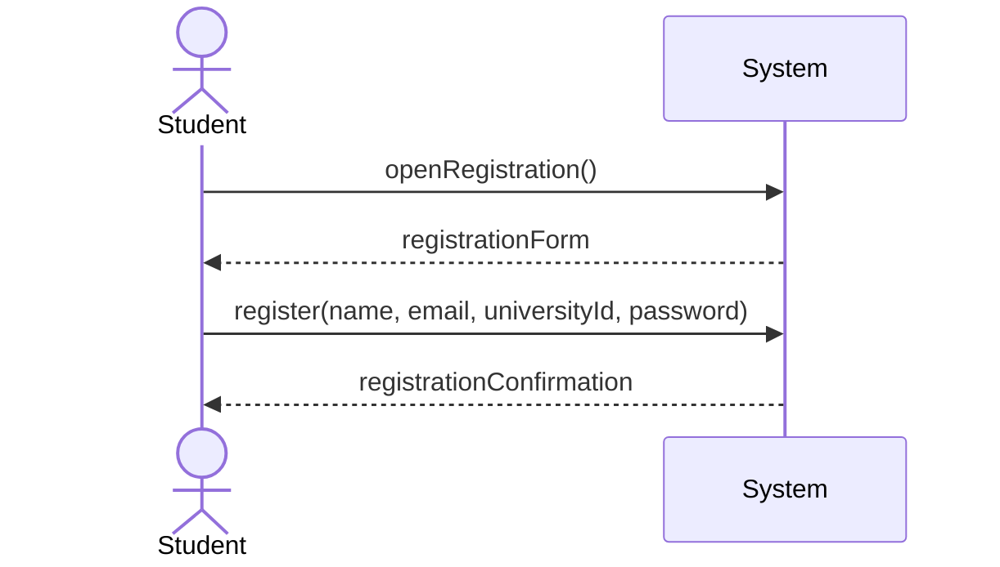

### UC2 — Log In

```mermaid
sequenceDiagram
    actor Actor
    participant System

    Actor->>System: login(email, password)
    alt correct credentials
        System-->>Actor: success(sessionToken, role)
    else
        System-->>Actor: fail
    end
```

### UC3 — View Notifications

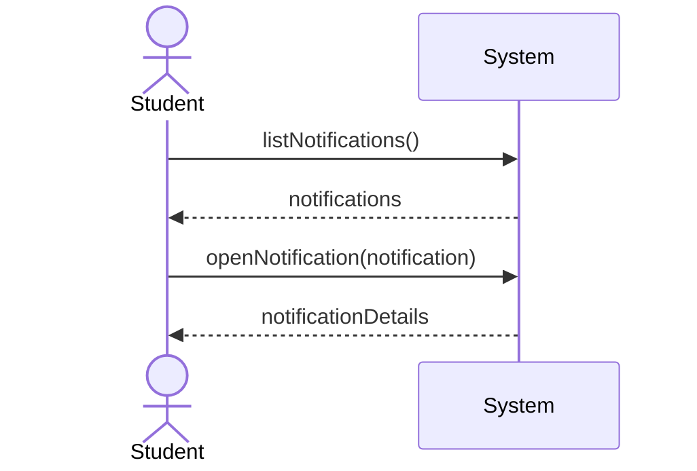

### UC4 — Search Catalog

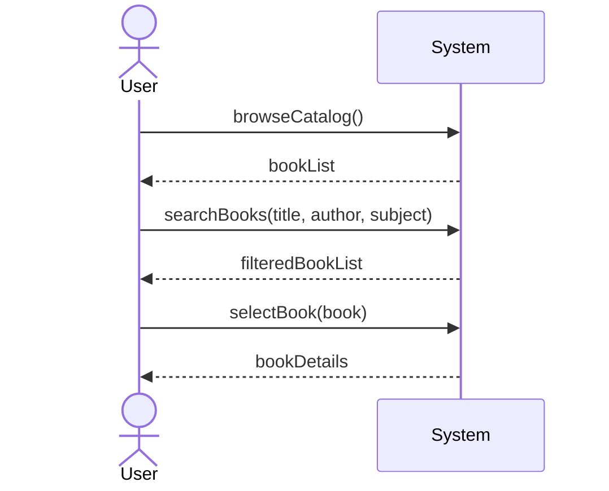

### UC5 — Reserve Book

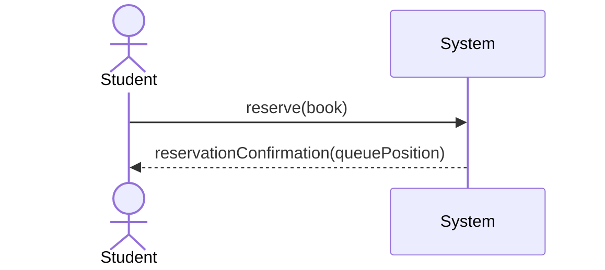

### UC6 — Cancel Reservation

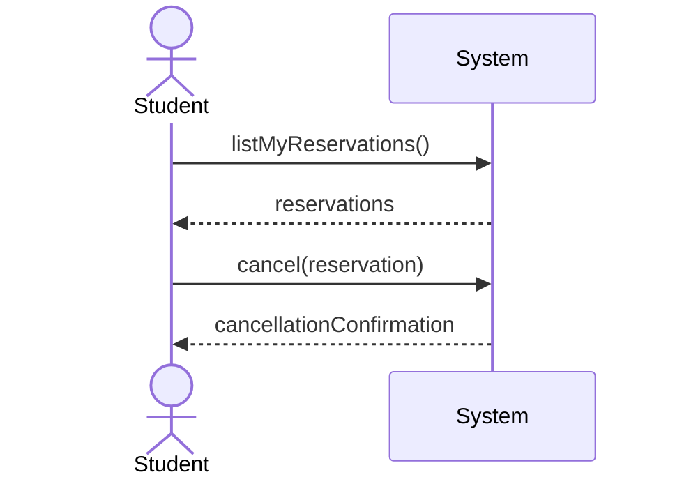

### UC7 — Borrow Book

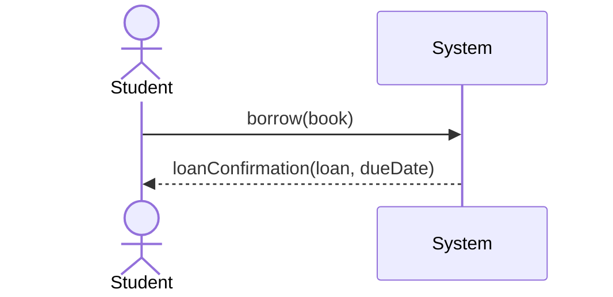

### UC8 — Return Book

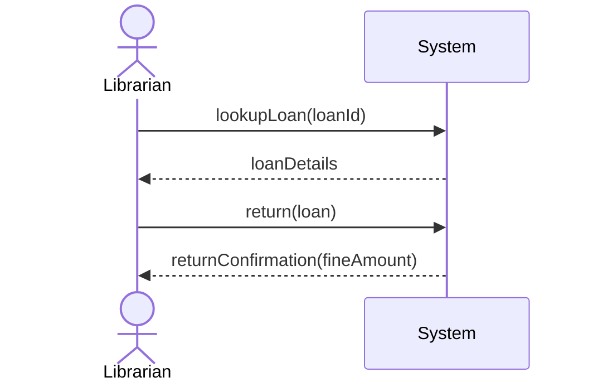

### UC9 — Renew Loan

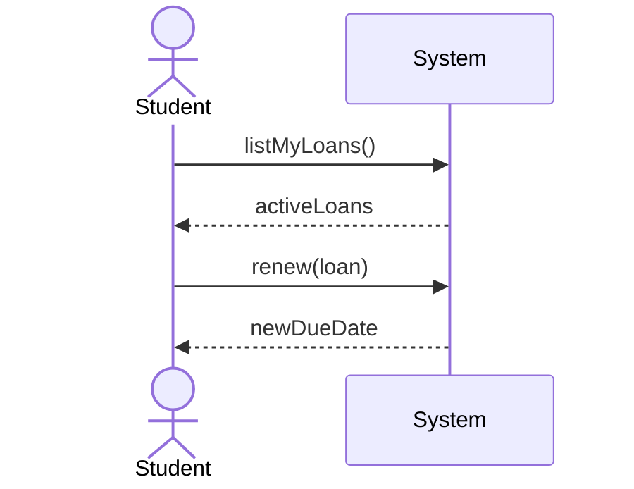

### UC10 — Pay Fine

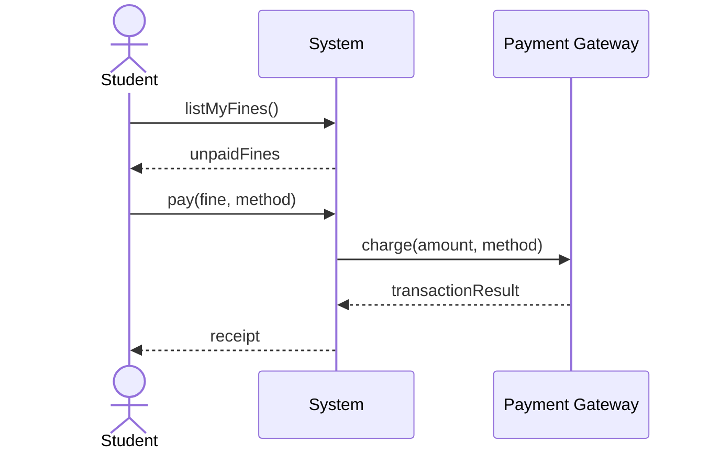

### UC11 — Manage Catalog

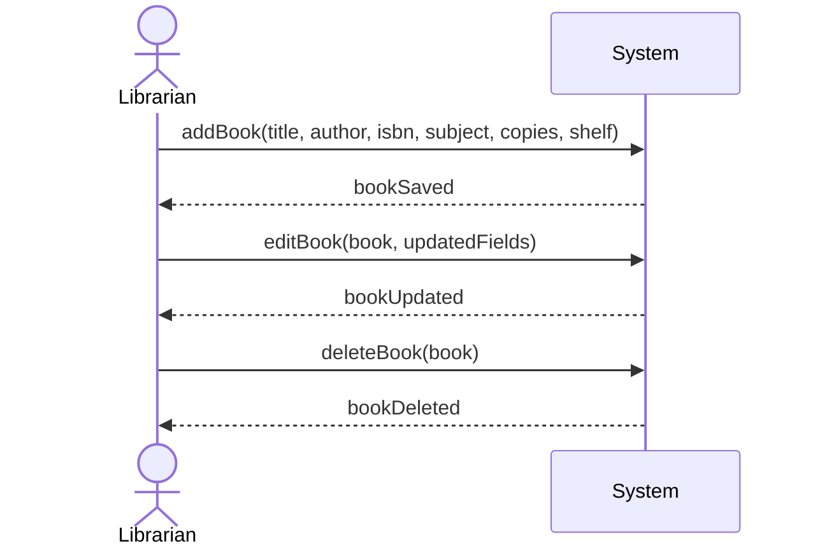

### UC12 — Manage Users

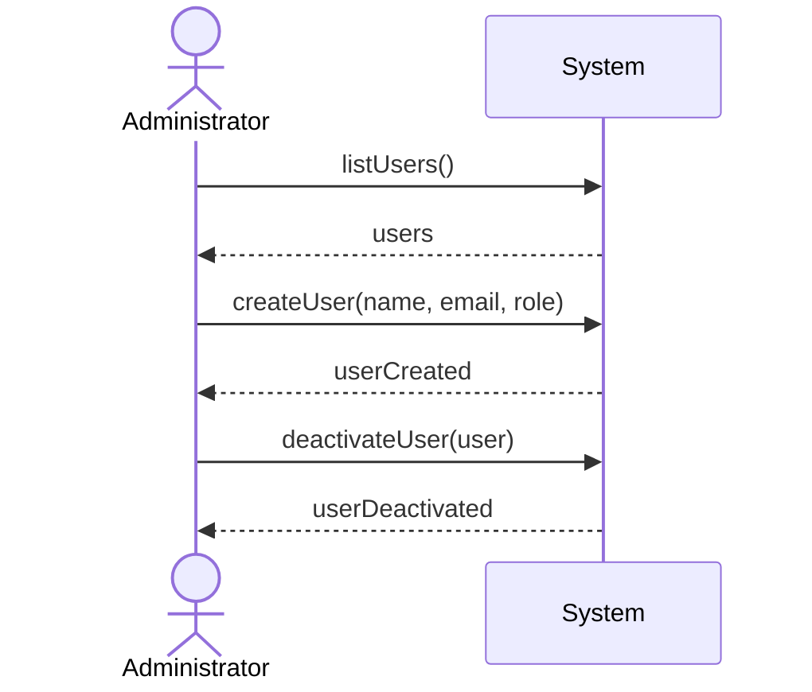

### UC13 — Calculate Fine

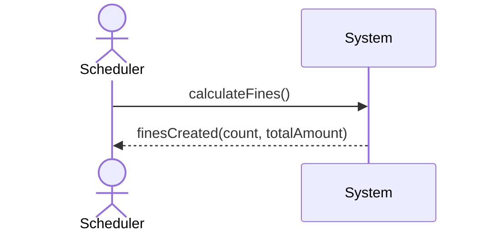

### UC14 — Send Notification

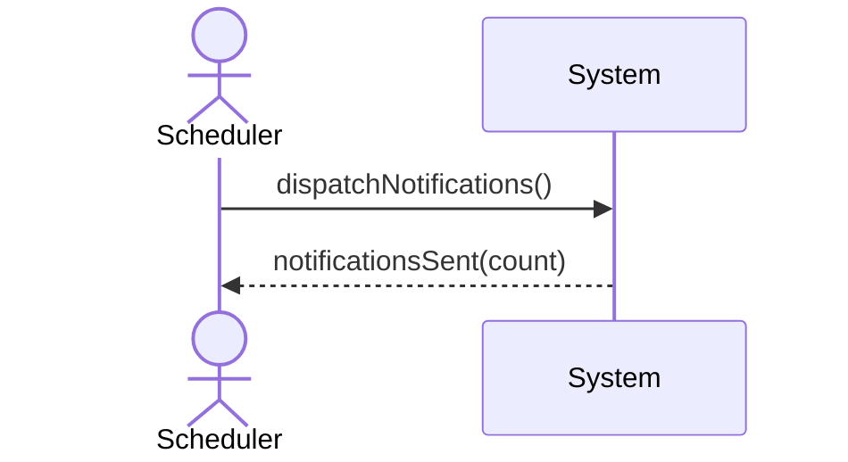

---

## 2f. Operation Contracts

Two operations with meaningful effects on domain state are contracted below: `borrow` and `return`. These correspond to the two most state-changing methods in the system.

### Contract 1 — `borrow(book: Book)`

| Field          | Contents                                                                 |
|----------------|--------------------------------------------------------------------------|
| Operation      | `borrow(book: Book)`                                                     |
| Cross reference| UC7 Borrow Book                                                          |
| Preconditions  | Student *s* is logged in; Student *s* has no Fine with status ≠ PAID; Book *book* has available_copies > 0. |
| Postconditions | Loan *l* created; *l* associated to Student *s*; *l* associated to Book *book*; *l*.borrow_date = today; *l*.due_date = today + 14 days; *l*.status = ACTIVE; *l*.renewal_count = 0; *book*.available_copies decremented by 1. |

### Contract 2 — `return(loan: Loan)`

| Field          | Contents                                                                 |
|----------------|--------------------------------------------------------------------------|
| Operation      | `return(loan: Loan)`                                                     |
| Cross reference| UC8 Return Book                                                          |
| Preconditions  | Loan *loan* exists; *loan*.status ≠ RETURNED.                            |
| Postconditions | *loan*.status = RETURNED; *loan*.return_date = today; *loan*.book.available_copies incremented by 1; If the oldest Reservation *r* for *loan*.book with status = ACTIVE exists: *r*.status = FULFILLED; If today > *loan*.due_date: Fine *f* created; *f* associated to Loan *loan*; *f*.amount = (today − *loan*.due_date in days) × €1.00; *f*.calculated_date = today; *f*.status = UNPAID. |

---

*End of Milestone 2 deliverable.*
