# Milestone 3 — Design

**Project:** ULMS — University Library Management System
**Course:** Software Development Methods · Politehnica University of Bucharest
**Author:** Mihai Tintareanu
**Milestone:** 3 — Design

---

## Table of Contents

- [3a. Design Class Diagrams](#3a-design-class-diagrams)
  - [3a.1 Use-case → class participation map](#3a1-use-case--class-participation-map)
  - [3a.2 Notation conventions](#3a2-notation-conventions)
  - [3a.3 Per-use-case class diagrams](#3a3-per-use-case-class-diagrams)
- [3b. Design Sequence Diagrams](#3b-design-sequence-diagrams)
  - [3b.1 Notation conventions](#3b1-notation-conventions)
  - [3b.2 Per-use-case sequence diagrams](#3b2-per-use-case-sequence-diagrams)
- [3c. Loan Statechart](#3c-loan-statechart)
- [3d. Software Architecture](#3d-software-architecture)
  - [3d.1 Logical view](#3d1-logical-view)
  - [3d.2 Physical view](#3d2-physical-view)
- [3e. Verification](#3e-verification)

---

## 3a. Design Class Diagrams

The class diagrams below refine the M2 conceptual model with the actual server-side classes implemented in `src/ulms/src/main/java/dev/tmmc/ulms/`. Each use case shows the controller, the service that hosts the transactional method, the repository (or repositories) it touches, and the entities involved. Cross-cutting collaborators that appear on every authenticated path — `JwtAuthenticationFilter`, `JwtPrincipal`, `OwnershipChecker`, `GlobalExceptionHandler`, `SecurityConfig` — are drawn once in section [3d.1](#3d1-logical-view) and referenced from each per-UC diagram with a note rather than redrawn 14 times.

A short clarification on two entities that look similar but are not duplicates: `Book` is the bibliographic + inventory record (title, author, ISBN, total/available copies, shelf number) and is the aggregate that UC4–UC11 read and write. `LibraryCatalog` is a small per-row metadata aggregate with only `totalBooks` and `lastUpdated` — librarians edit it through `LibraryCatalogController` to refresh global counters, and it does not hold book references.

### 3a.1 Use-case → class participation map

| UC | Actor(s) | Controller | Service | Repository(ies) | Entity(ies) | External collaborators |
|----|----------|------------|---------|-----------------|-------------|------------------------|
| UC1 Register Account | Student | `AuthController` | `AuthService`, `UserService` | `UserRepository` | `User` | `PasswordEncoder`, `ApplicationEventPublisher`, `RegistrationCompletedEvent`, `RegistrationMailListener` (`@Async`), `MailService` |
| UC2 Log In | Student, Librarian, Admin | `AuthController` | `AuthService` | `UserRepository` | `User` | `PasswordEncoder`, `JwtService` |
| UC3 View Notifications | Student | `NotificationController` | `NotificationService` | `NotificationRepository` | `Notification`, `User` | `NotificationMapper` |
| UC4 Search Catalog | Student, Librarian | `BookController`, `LibraryCatalogController` | `BookService`, `LibraryCatalogService` | `BookRepository`, `LibraryCatalogRepository` | `Book`, `LibraryCatalog` | `BookMapper`, `LibraryCatalogMapper` |
| UC5 Reserve Book | Student | `ReservationController` | `ReservationService` | `ReservationRepository`, `BookRepository`, `UserRepository` | `Reservation`, `Book`, `User` | `ReservationMapper` |
| UC6 Cancel Reservation | Student | `ReservationController` | `ReservationService` | `ReservationRepository` | `Reservation` | `OwnershipChecker` |
| UC7 Borrow Book | Student | `LoanController` | `LoanService` | `LoanRepository`, `BookRepository`, `UserRepository`, `FineRepository` | `Loan`, `Book`, `User`, `Fine` | `LoanMapper` |
| UC8 Return Book | Librarian | `LoanController` | `LoanService` | `LoanRepository`, `BookRepository`, `FineRepository`, `ReservationRepository` | `Loan`, `Book`, `Fine`, `Reservation` | `LoanMapper` (includes UC13) |
| UC9 Renew Loan | Student | `LoanController` | `LoanService` | `LoanRepository`, `FineRepository` | `Loan`, `Fine`, `User` | `OwnershipChecker` |
| UC10 Pay Fine | Student → Payment Gateway | `PaymentController` | `PaymentService` | `PaymentRepository`, `FineRepository` | `Payment`, `Fine`, `User` | `PaymentGatewayClient` («interface»), `MockPaymentGatewayClient`, `PaymentMapper` |
| UC11 Manage Catalog | Librarian | `BookController`, `LibraryCatalogController` | `BookService`, `LibraryCatalogService` | `BookRepository`, `LibraryCatalogRepository`, `LoanRepository` | `Book`, `LibraryCatalog` | `BookMapper`, `BookInUseException` guard |
| UC12 Manage Users | Administrator | `UserController` | `UserService`, `LoanService`, `FineService` | `UserRepository`, `LoanRepository`, `FineRepository` | `User` | `PasswordEncoder`, `UserMapper`, `UserHistoryResponse` |
| UC13 Calculate Fine | Scheduler | — («Component» `FineCalculationJob`) | `FineService` | `LoanRepository`, `FineRepository` | `Loan`, `Fine`, `SchedulerRun` | `SchedulerRunRecorder` |
| UC14 Send Notification | Scheduler | — («Component» `NotificationDispatchJob`) | `NotificationService` | `LoanRepository`, `ReservationRepository`, `NotificationRepository` | `Loan`, `Reservation`, `Notification`, `SchedulerRun` | `SchedulerRunRecorder` |

### 3a.2 Notation conventions

- **Stereotypes** label the role of each class: `<<RestController>>`, `<<Service>>`, `<<Repository>>`, `<<Entity>>`, `<<Mapper>>`, `<<Component>>` (jobs), `<<Filter>>`, `<<Strategy>>`, `<<interface>>`.
- A `..>` arrow means *uses* (typical controller → service → repository wiring). A solid `-->` with multiplicity marks a JPA association between entities. A `..|>` arrow marks interface realization (used for `MockPaymentGatewayClient ..|> PaymentGatewayClient`).
- Operation lists are pruned to the 3–5 methods exercised by the use case; the full class signatures live in code.
- JPA relationships are labelled with role names rather than column names. Repositories show only the custom or otherwise interesting query methods; standard `JpaRepository` CRUD is implied.

### 3a.3 Per-use-case class diagrams

#### UC1 — Register Account

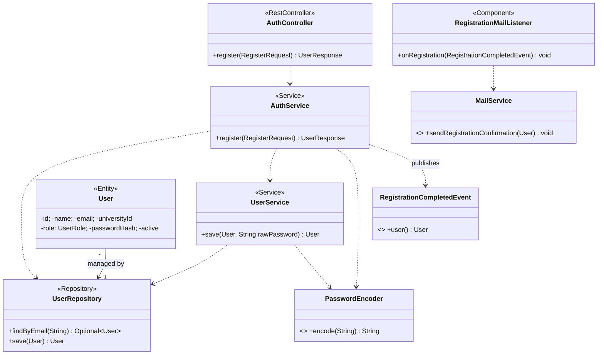

> Pre-authorized by `JwtAuthenticationFilter` is **not** required — `/api/auth/**` is `permitAll`. The async-email path runs after commit on the `ulmsTaskExecutor` thread (see [3d.1](#3d1-logical-view)).

#### UC2 — Log In

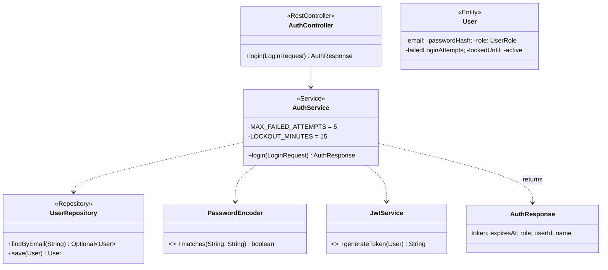

#### UC3 — View Notifications

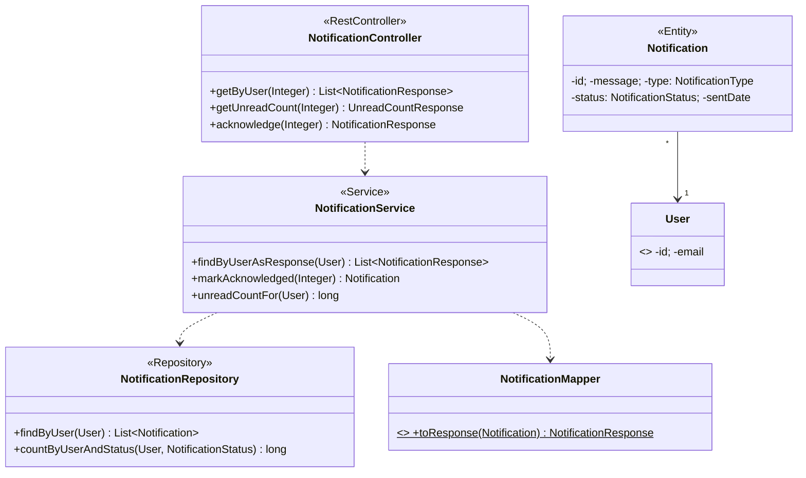

> `OwnershipChecker.requireOwnerOrStaff` is invoked inside `markAcknowledged` and `findByIdAsResponse` (cross-cutting, see [3d.1](#3d1-logical-view)).

#### UC4 — Search Catalog

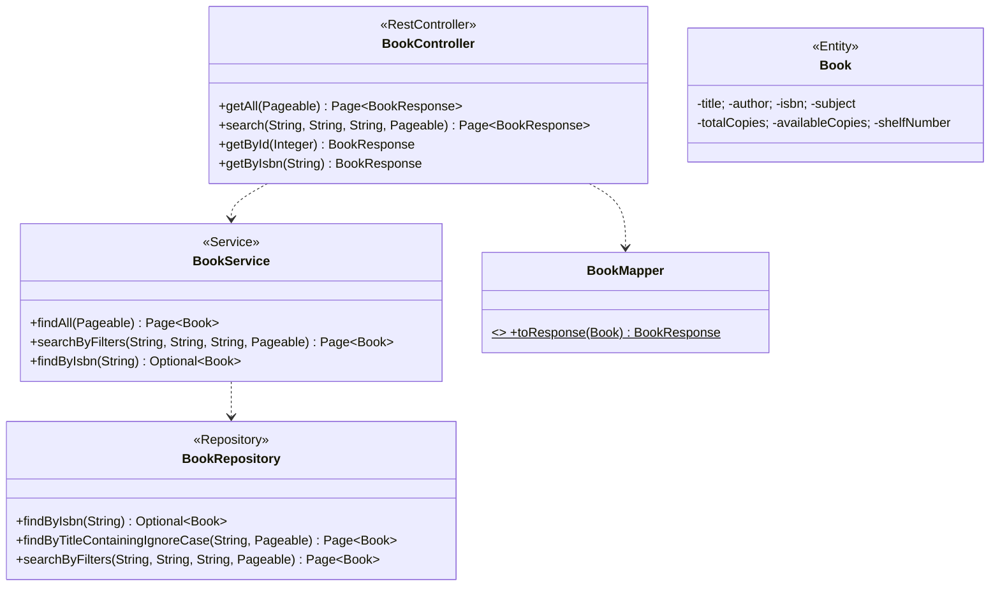

#### UC5 — Reserve Book

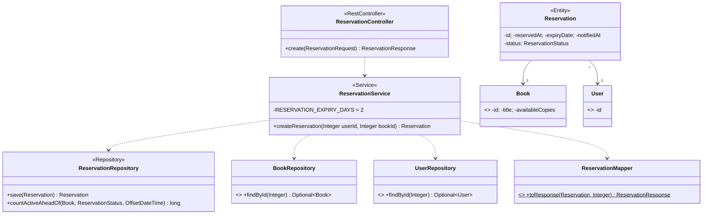

#### UC6 — Cancel Reservation

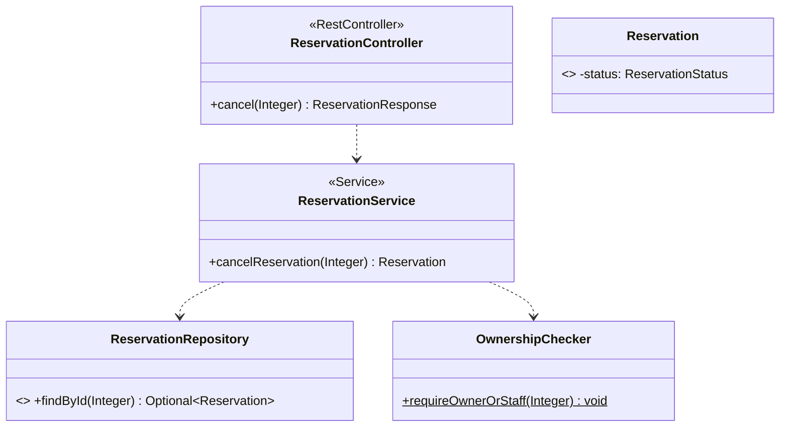

#### UC7 — Borrow Book

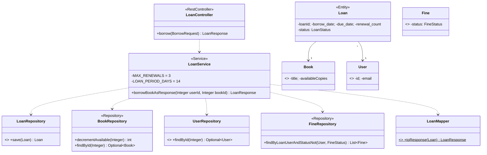

#### UC8 — Return Book

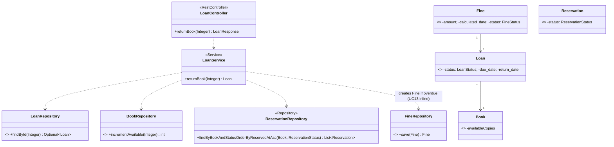

#### UC9 — Renew Loan

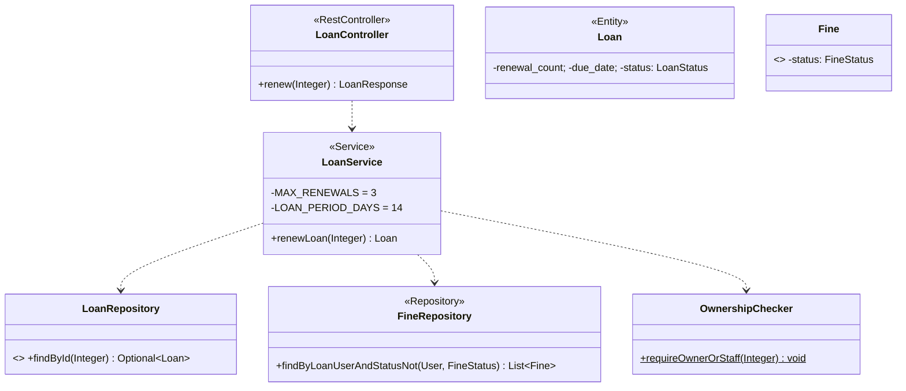

#### UC10 — Pay Fine

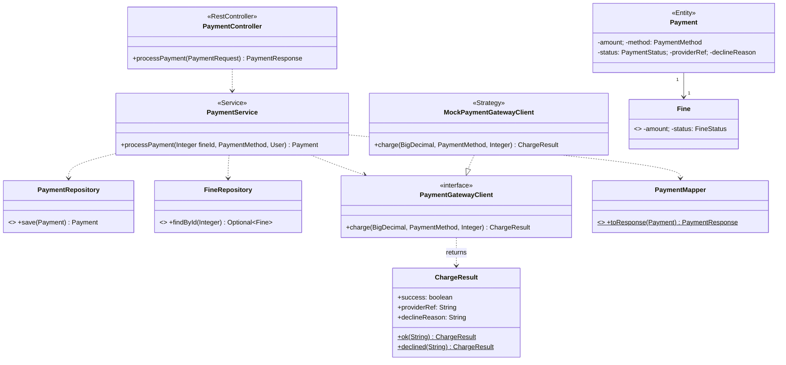

#### UC11 — Manage Catalog

```mermaid
classDiagram
    class BookController {
        <<RestController>>
        +create(CreateBookRequest) BookResponse
        +update(Integer, CreateBookRequest) BookResponse
        +delete(Integer) ResponseEntity
    }
    class LibraryCatalogController {
        <<RestController>>
        +create(CreateLibraryCatalogRequest) LibraryCatalogResponse
        +update(Integer, CreateLibraryCatalogRequest) LibraryCatalogResponse
        +delete(Integer) ResponseEntity
    }
    class BookService {
        <<Service>>
        +save(Book) Book
        +deleteById(Integer) void
        -BLOCKING_LOAN_STATUSES = {ACTIVE, RENEWED, OVERDUE}
    }
    class LibraryCatalogService { <<Service>> +save(LibraryCatalog) LibraryCatalog }
    class BookRepository { <<Repository>> +save(Book) Book }
    class LoanRepository { <<Repository>> +existsByBook_IdAndStatusIn(Integer, EnumSet) boolean }
    class LibraryCatalogRepository { <<Repository>> +save(LibraryCatalog) LibraryCatalog }
    class Book { <<Entity>> -isbn (unique); -totalCopies; -availableCopies }
    class LibraryCatalog { <<Entity>> -totalBooks; -lastUpdated }
    class BookMapper { <<Mapper>> +toEntity(CreateBookRequest)$ Book }
    class BookInUseException { <<Exception>> }

    BookController ..> BookService
    BookController ..> BookMapper
    LibraryCatalogController ..> LibraryCatalogService
    BookService ..> BookRepository
    BookService ..> LoanRepository : guards delete
    BookService ..> BookInUseException : throws if active loans
    LibraryCatalogService ..> LibraryCatalogRepository
```

#### UC12 — Manage Users

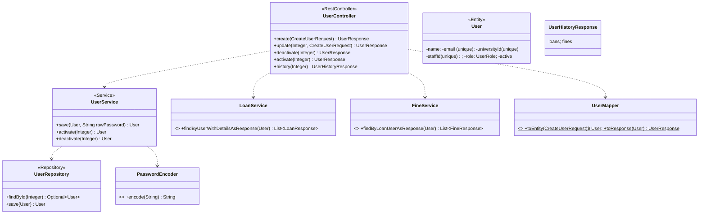

#### UC13 — Calculate Fine (system use case)

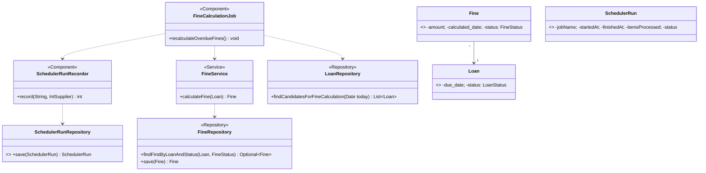

> No controller — `FineCalculationJob` is triggered by `@Scheduled(cron = "0 0 2 * * *", zone = "Europe/Bucharest")`.

#### UC14 — Send Notification (system use case)

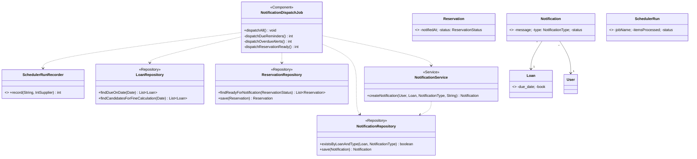

> Triggered by `@Scheduled(cron = "0 5 2 * * *", zone = "Europe/Bucharest")`. The three private dispatchers (`dispatchDueReminders`, `dispatchOverdueAlerts`, `dispatchReservationReady`) all funnel into `NotificationService.createNotification` and persist via `NotificationRepository`.

---

## 3b. Design Sequence Diagrams

### 3b.1 Notation conventions

- Lifelines run left-to-right in this order: actor → controller → service → repository (one or more) → entity / external collaborator. The controller is always present even when the message is short, because it is the place where Spring applies `@PreAuthorize` and request validation (`@Valid`).
- A solid arrow `->>` is a synchronous call; a dashed arrow `-->>` is a return.
- The transactional boundary is annotated as `Note over XService: @Transactional` so that the diagrams make explicit when atomic write paths begin.
- `alt` frames are used **only** on UC2 (login: success / invalid credentials / locked account) and UC10 (payment: gateway accepted vs declined). Every other UC shows the happy path; alternate flows are documented in M2.
- For the two scheduler-driven use cases (UC13, UC14) the actor is replaced by a `participant Scheduler` and a `%% triggered by @Scheduled` comment, since there is no human in the loop.

### 3b.2 Per-use-case sequence diagrams

#### UC1 — Register Account

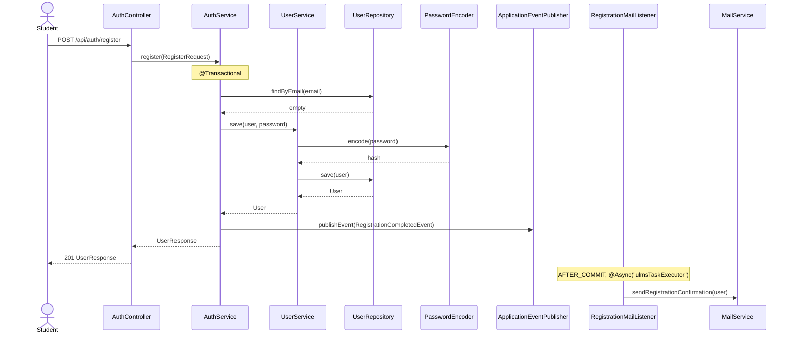

#### UC2 — Log In

```mermaid
sequenceDiagram
    actor Actor
    participant AC as AuthController
    participant AS as AuthService
    participant UR as UserRepository
    participant PE as PasswordEncoder
    participant JS as JwtService

    Actor->>AC: POST /api/auth/login {email, password}
    AC->>AS: login(LoginRequest)
    Note over AS: @Transactional(noRollbackFor = AuthExceptions)
    AS->>UR: findByEmail(email)
    UR-->>AS: User
    alt correct credentials
        AS->>PE: matches(password, hash)
        PE-->>AS: true
        AS->>UR: save(user{failed=0, lockedUntil=null})
        AS->>JS: generateToken(user)
        JS-->>AS: jwt
        AS-->>AC: AuthResponse(token, expiresAt, role)
        AC-->>Actor: 200 AuthResponse
    else invalid credentials
        AS->>PE: matches(password, hash)
        PE-->>AS: false
        AS->>UR: save(user{failed += 1})
        AS-->>AC: throw InvalidCredentialsException
        AC-->>Actor: 401
    else account locked (≥ 5 failures)
        AS->>UR: save(user{failed=0, lockedUntil=now+15m})
        AS-->>AC: throw AccountLockedException
        AC-->>Actor: 423
    end
```

#### UC3 — View Notifications

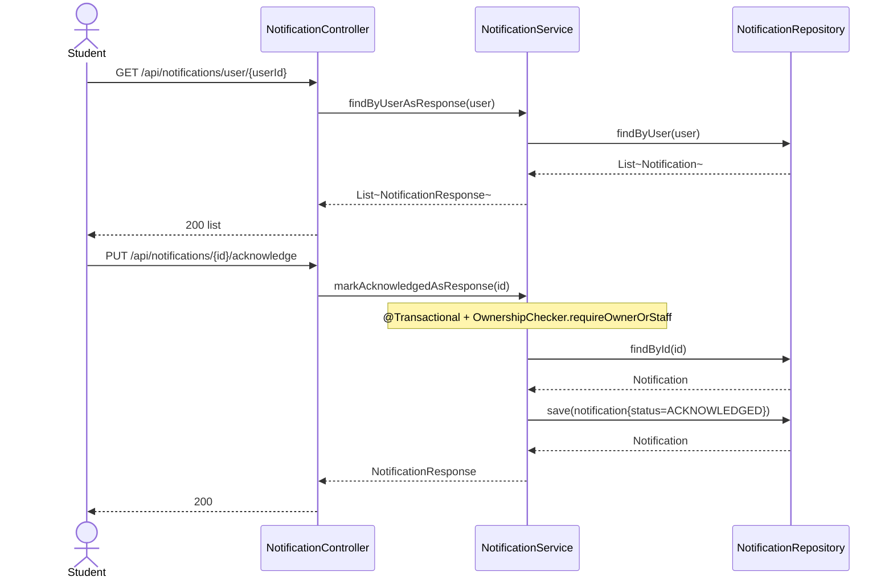

#### UC4 — Search Catalog

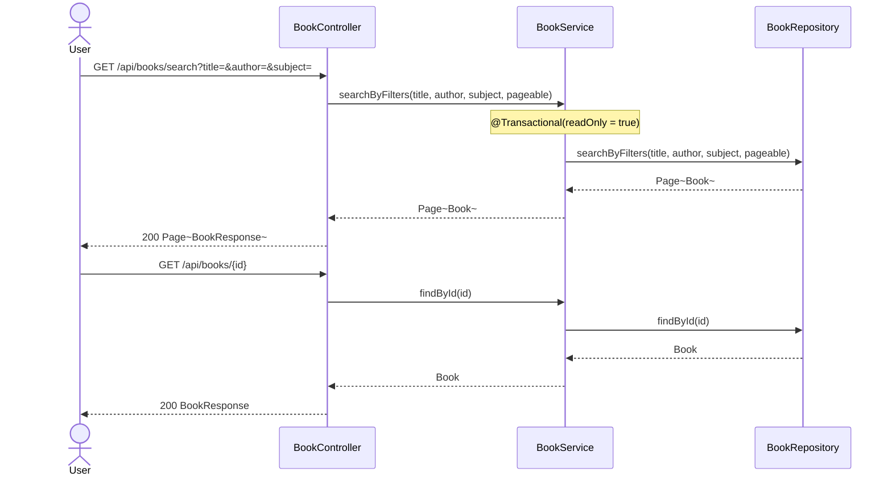

#### UC5 — Reserve Book

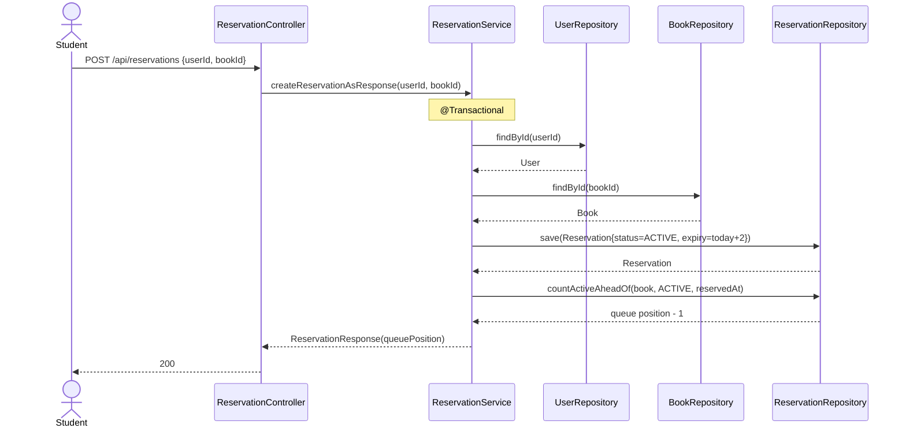

#### UC6 — Cancel Reservation

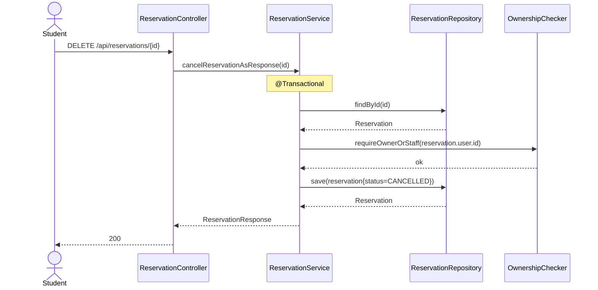

#### UC7 — Borrow Book

```mermaid
sequenceDiagram
    actor Student
    participant LC as LoanController
    participant LS as LoanService
    participant UR as UserRepository
    participant BR as BookRepository
    participant FR as FineRepository
    participant LR as LoanRepository

    Student->>LC: POST /api/loans/borrow {userId, bookId}
    LC->>LS: borrowBookAsResponse(userId, bookId)
    Note over LS: @Transactional
    LS->>UR: findById(userId)
    UR-->>LS: User
    LS->>BR: findById(bookId)
    BR-->>LS: Book
    LS->>FR: findByLoanUserAndStatusNot(user, PAID)
    FR-->>LS: []
    LS->>BR: decrementAvailable(bookId)
    BR-->>LS: 1 (atomic UPDATE)
    LS->>LR: save(Loan{status=ACTIVE, due=today+14})
    LR-->>LS: Loan
    LS-->>LC: LoanResponse
    LC-->>Student: 200 LoanResponse
```

#### UC8 — Return Book (includes UC13)

```mermaid
sequenceDiagram
    actor Librarian
    participant LC as LoanController
    participant LS as LoanService
    participant LR as LoanRepository
    participant BR as BookRepository
    participant RR as ReservationRepository
    participant FR as FineRepository

    Librarian->>LC: PUT /api/loans/{id}/return
    LC->>LS: returnBookAsResponse(id)
    Note over LS: @Transactional
    LS->>LR: findById(id)
    LR-->>LS: Loan
    LS->>BR: incrementAvailable(book.id)
    BR-->>LS: 1
    LS->>RR: findByBookAndStatusOrderByReservedAtAsc(book, ACTIVE)
    RR-->>LS: pending reservations
    LS->>RR: save(next{status=FULFILLED})
    RR-->>LS: Reservation
    alt return is overdue (UC13 inline)
        LS->>FR: save(Fine{amount=days×€1, status=UNPAID})
        FR-->>LS: Fine
    end
    LS->>LR: save(loan{status=RETURNED, return_date=today})
    LR-->>LS: Loan
    LS-->>LC: LoanResponse
    LC-->>Librarian: 200
```

#### UC9 — Renew Loan

```mermaid
sequenceDiagram
    actor Student
    participant LC as LoanController
    participant LS as LoanService
    participant LR as LoanRepository
    participant FR as FineRepository
    participant OC as OwnershipChecker

    Student->>LC: PUT /api/loans/{id}/renew
    LC->>LS: renewLoanAsResponse(id)
    Note over LS: @Transactional
    LS->>LR: findById(id)
    LR-->>LS: Loan
    LS->>OC: requireOwnerOrStaff(loan.user.id)
    OC-->>LS: ok
    LS->>FR: findByLoanUserAndStatusNot(user, PAID)
    FR-->>LS: []
    Note right of LS: guard: renewal_count < 3 ∧ noUnpaidFines
    LS->>LR: save(loan{renewal_count+=1, due+=14, status=RENEWED})
    LR-->>LS: Loan
    LS-->>LC: LoanResponse
    LC-->>Student: 200
```

#### UC10 — Pay Fine

```mermaid
sequenceDiagram
    actor Student
    participant PC as PaymentController
    participant PS as PaymentService
    participant FR as FineRepository
    participant GW as PaymentGatewayClient
    participant PR as PaymentRepository

    Student->>PC: POST /api/payments {userId, fineId, method}
    PC->>PS: processPaymentAsResponse(fineId, method, user)
    Note over PS: @Transactional(noRollbackFor = PaymentDeclinedException)
    PS->>FR: findById(fineId)
    FR-->>PS: Fine
    PS->>GW: charge(amount, method, fineId)
    alt gateway accepts
        GW-->>PS: ChargeResult.ok(providerRef)
        PS->>FR: save(fine{status=PAID})
        PS->>PR: save(Payment{status=COMPLETED, providerRef})
        PR-->>PS: Payment
        PS-->>PC: PaymentResponse
        PC-->>Student: 200
    else gateway declines
        GW-->>PS: ChargeResult.declined(reason)
        PS->>PR: save(Payment{status=FAILED, declineReason})
        PR-->>PS: Payment
        PS-->>PC: throw PaymentDeclinedException
        PC-->>Student: 402
    end
```

#### UC11 — Manage Catalog

```mermaid
sequenceDiagram
    actor Librarian
    participant BC as BookController
    participant BS as BookService
    participant BR as BookRepository
    participant LR as LoanRepository

    Librarian->>BC: POST /api/books (CreateBookRequest)
    BC->>BS: save(book)
    Note over BS: @Transactional
    BS->>BR: save(book)
    BR-->>BS: Book
    BS-->>BC: Book
    BC-->>Librarian: 200 BookResponse

    Librarian->>BC: PUT /api/books/{id}
    BC->>BS: save(book{id})
    BS->>BR: save(book)
    BR-->>BS: Book
    BS-->>BC: Book
    BC-->>Librarian: 200 BookResponse

    Librarian->>BC: DELETE /api/books/{id}
    BC->>BS: deleteById(id)
    BS->>LR: existsByBook_IdAndStatusIn(id, {ACTIVE, RENEWED, OVERDUE})
    LR-->>BS: false
    BS->>BR: deleteById(id)
    BR-->>BS: ok
    BC-->>Librarian: 204
```

#### UC12 — Manage Users

```mermaid
sequenceDiagram
    actor Admin
    participant UC as UserController
    participant US as UserService
    participant UR as UserRepository
    participant LS as LoanService
    participant FS as FineService

    Admin->>UC: POST /api/users (CreateUserRequest)
    UC->>US: save(user, rawPassword)
    Note over US: @Transactional + PasswordEncoder.encode
    US->>UR: save(user)
    UR-->>US: User
    US-->>UC: User
    UC-->>Admin: 200 UserResponse

    Admin->>UC: PUT /api/users/{id}/deactivate
    UC->>US: deactivate(id)
    US->>UR: findById(id)
    UR-->>US: User
    US->>UR: save(user{active=false})
    UR-->>US: User
    US-->>UC: User
    UC-->>Admin: 200 UserResponse

    Admin->>UC: GET /api/users/{id}/history
    UC->>US: findById(id)
    US-->>UC: User
    UC->>LS: findByUserWithDetailsAsResponse(user)
    LS-->>UC: List~LoanResponse~
    UC->>FS: findByLoanUserAsResponse(user)
    FS-->>UC: List~FineResponse~
    UC-->>Admin: 200 UserHistoryResponse
```

#### UC13 — Calculate Fine (system use case)

```mermaid
sequenceDiagram
    participant SCH as Scheduler
    participant FCJ as FineCalculationJob
    participant SRR as SchedulerRunRecorder
    participant LR as LoanRepository
    participant FS as FineService
    participant FR as FineRepository
    participant SR as SchedulerRunRepository

    %% triggered by @Scheduled(cron = "0 0 2 * * *")
    SCH->>FCJ: recalculateOverdueFines()
    FCJ->>SRR: record("fine-calculation", work)
    Note over SRR: @Transactional(REQUIRES_NEW)
    SRR->>SR: save(SchedulerRun{startedAt, status=OK})
    SRR->>FCJ: invoke work
    FCJ->>LR: findCandidatesForFineCalculation(today)
    LR-->>FCJ: List~Loan~
    loop for each overdue loan
        FCJ->>FS: calculateFine(loan)
        Note over FS: @Transactional, idempotent
        FS->>FR: findFirstByLoanAndStatus(loan, UNPAID)
        FR-->>FS: empty
        FS->>FR: save(Fine{amount=days×€1, status=UNPAID})
        FR-->>FS: Fine
    end
    FCJ-->>SRR: itemsProcessed
    SRR->>SR: save(SchedulerRun{finishedAt, status=OK, itemsProcessed})
```

#### UC14 — Send Notification (system use case)

```mermaid
sequenceDiagram
    participant SCH as Scheduler
    participant NDJ as NotificationDispatchJob
    participant SRR as SchedulerRunRecorder
    participant LR as LoanRepository
    participant RR as ReservationRepository
    participant NR as NotificationRepository
    participant NS as NotificationService

    %% triggered by @Scheduled(cron = "0 5 2 * * *")
    SCH->>NDJ: dispatchAll()
    NDJ->>SRR: record("notification-dispatch", work)
    Note over SRR: @Transactional(REQUIRES_NEW)

    NDJ->>LR: findDueOnDate(today + dueReminderDaysAhead)
    LR-->>NDJ: List~Loan~
    loop for each due-soon loan (no DUE_REMINDER yet)
        NDJ->>NR: existsByLoanAndType(loan, DUE_REMINDER)
        NR-->>NDJ: false
        NDJ->>NS: createNotification(user, loan, DUE_REMINDER, msg)
        NS->>NR: save(Notification)
    end

    NDJ->>LR: findCandidatesForFineCalculation(today)
    LR-->>NDJ: List~Loan~
    loop for each overdue loan (no OVERDUE_ALERT yet)
        NDJ->>NS: createNotification(user, loan, OVERDUE_ALERT, msg)
        NS->>NR: save(Notification)
    end

    NDJ->>RR: findReadyForNotification(ACTIVE)
    RR-->>NDJ: List~Reservation~
    loop for each ready reservation
        NDJ->>NS: createNotification(user, null, RESERVATION_READY, msg)
        NS->>NR: save(Notification)
        NDJ->>RR: save(reservation{notifiedAt=now})
    end

    NDJ-->>SRR: itemsProcessed
```

---

## 3c. Loan Statechart

The `Loan` aggregate has the richest lifecycle in the domain — it is the object that ties together UC7 (borrow), UC8 (return), UC9 (renew) and the scheduled UC13 (fine calculation), and it is the only one whose state actively gates other use cases (a `RETURNED` loan cannot be renewed; a `RENEWED` loan respects the renewal cap; an `OVERDUE` loan triggers fine creation on return).

### States and triggers

| From → To | Trigger | Code reference |
|---|---|---|
| `[*]` → `ACTIVE` | borrow | `LoanService.borrowBook` (sets `status=ACTIVE`, `due_date=today+14`, `renewal_count=0`) |
| `ACTIVE` → `RENEWED` | renew `[renewal_count < 3 ∧ noUnpaidFines]` | `LoanService.renewLoan` |
| `RENEWED` → `RENEWED` | renew (same guard) | `LoanService.renewLoan` (re-entry; up to 3 total renewals) |
| `ACTIVE` / `RENEWED` → `OVERDUE` | scheduler detects `due_date < today` | `FineCalculationJob.recalculateOverdueFines` (cron `0 0 2 * * *`) — implicit via the candidate query |
| `ACTIVE` / `RENEWED` / `OVERDUE` → `RETURNED` | return | `LoanService.returnBook` (creates `Fine` if past due) |
| any → `LOST` *(future)* | not yet implemented in service code | `LoanStatus.LOST` is referenced only as a filter-out clause in `LoanRepository.java:29,35`; no setter path exists yet |
| `RETURNED` → `[*]`, `LOST` → `[*]` | terminal | — |

### Diagram

```mermaid
stateDiagram-v2
    [*] --> ACTIVE : borrow / LoanService.borrowBook
    ACTIVE --> RENEWED : renew [renewal_count<3 ∧ noUnpaidFines] / LoanService.renewLoan
    RENEWED --> RENEWED : renew [renewal_count<3 ∧ noUnpaidFines]
    ACTIVE --> OVERDUE : schedulerDetectsOverdue / FineCalculationJob
    RENEWED --> OVERDUE : schedulerDetectsOverdue
    ACTIVE --> RETURNED : return / LoanService.returnBook
    RENEWED --> RETURNED : return
    OVERDUE --> RETURNED : return [creates Fine]
    ACTIVE --> LOST : markLost (future)
    RENEWED --> LOST : markLost (future)
    OVERDUE --> LOST : markLost (future)
    RETURNED --> [*]
    LOST --> [*]
```

### Guards

- `MAX_RENEWALS = 3` — `LoanService.renewLoan` rejects when `renewal_count >= 3`.
- `LOAN_PERIOD_DAYS = 14` — both initial `due_date` (UC7) and the renewed `due_date` (UC9) are extended by this constant.
- `noUnpaidFines` — predicate evaluated as `fineRepository.findByLoanUserAndStatusNot(user, PAID).isEmpty()`. Same predicate gates UC7 (borrow) and UC9 (renew).
- `LOST` is shown as a future state — the `LoanStatus` enum carries the value, the repository queries already exclude it from active sets, but no service path writes it. This is intentionally documented rather than invented for the diagram.

---

## 3d. Software Architecture

### 3d.1 Logical view

ULMS follows a classic **layered architecture** on the server side, with cross-cutting bands (security, transactions, async, scheduling) wrapping the request path. The frontend is an entirely separate Next.js application that consumes the JSON API; it has no direct database access.

```mermaid
flowchart TB
    subgraph Presentation["Presentation (Next.js 16 / React 19)"]
        UI[React components<br/>shadcn/ui + Tailwind]
    end

    subgraph API["API layer (Spring Boot 4)"]
        CTRL["REST Controllers<br/>(@RestController + @PreAuthorize)"]
        SVC["Service layer<br/>(@Service + @Transactional)"]
        REPO["Repositories<br/>(JpaRepository + custom queries)"]
        ENT["JPA Entities"]
    end

    subgraph CrossCutting["Cross-cutting"]
        SEC["SecurityConfig<br/>+ JwtAuthenticationFilter<br/>+ JwtPrincipal<br/>+ OwnershipChecker"]
        ASY["AsyncConfig<br/>(ulmsTaskExecutor)"]
        SCH["Scheduler<br/>(jobs/* + SchedulerRunRecorder)"]
        EXC["GlobalExceptionHandler<br/>(RFC 7807 problem JSON)"]
        FLY["Flyway migrations"]
    end

    DB[("Postgres 18")]

    UI -->|HTTPS / JSON| CTRL
    CTRL --> SVC
    SVC --> REPO
    REPO --> ENT
    ENT --> DB

    SEC -.-> CTRL
    EXC -.-> CTRL
    ASY -.-> SVC
    SCH -.-> SVC
    FLY -.-> DB
```

#### Package map

The backend is organised under `dev.tmmc.ulms`:

```
dev.tmmc.ulms/
├── UlmsApplication            (Spring Boot bootstrap)
├── config/
│   ├── SecurityConfig         (filter chain, CORS, BCrypt bean)
│   ├── AsyncConfig            (ulmsTaskExecutor, @EnableAsync)
│   └── OpenApiConfig          (Swagger/OpenAPI groups)
├── security/
│   ├── JwtAuthenticationFilter, JwtService, JwtPrincipal
│   ├── OwnershipChecker
│   ├── RestAuthenticationEntryPoint, RestAccessDeniedHandler
├── jobs/
│   ├── FineCalculationJob          (UC13)
│   ├── NotificationDispatchJob     (UC14)
│   └── SchedulerRunRecorder        (Template Method around scheduled work)
└── objects/
    ├── controllers/                (9 @RestControllers, one per aggregate)
    ├── services/
    │   ├── (10 @Service classes)
    │   ├── payment/PaymentGatewayClient, MockPaymentGatewayClient
    │   └── mail/MailService, RegistrationCompletedEvent, RegistrationMailListener
    ├── repositories/               (9 JpaRepository interfaces)
    ├── entities/                   (9 @Entity classes)
    │   └── enums/                  (9 enum types)
    ├── dto/
    │   ├── request/                (input DTOs as Java records)
    │   └── response/               (output DTOs as Java records)
    ├── mapper/                     (static toEntity / toResponse mappers)
    └── exceptions/                 (typed exceptions + GlobalExceptionHandler)
```

#### Design patterns observed

The patterns below are listed only when actually present in the source — Builder, Specification, and Lombok are intentionally absent.

| # | Pattern | Where it appears |
|---|---------|------------------|
| 1 | **Repository** (Spring Data) | every interface in `objects/repositories/` extends `JpaRepository`; custom `@Modifying @Query` methods such as `BookRepository.decrementAvailable` enforce atomic counter updates at the DB level. |
| 2 | **DTO + Mapper** | `dto/request/*Request` and `dto/response/*Response` are Java records; `mapper/*Mapper` classes hold static `toEntity` / `toResponse` methods so controllers never serialise entities directly. |
| 3 | **Strategy** | `services/payment/PaymentGatewayClient` is the strategy interface; `MockPaymentGatewayClient` is the dev/test impl; `PaymentService` depends on the interface. A real provider can be swapped in by registering a different bean — production code in `PaymentService` does not change. |
| 4 | **Observer / Event (Spring `ApplicationEvent`)** | `AuthService.register` publishes `RegistrationCompletedEvent`; `RegistrationMailListener` is `@TransactionalEventListener(AFTER_COMMIT)` + `@Async("ulmsTaskExecutor")`, so the email send is decoupled from the registration transaction and never blocks the HTTP response. |
| 5 | **Template Method** for scheduled work | `SchedulerRunRecorder.record(jobName, work)` wraps every `@Scheduled` invocation with start time, success/failure status, error truncation, and persistence to `SchedulerRun`. Both `FineCalculationJob` and `NotificationDispatchJob` are clients of this template. |
| 6 | **Filter Chain** | `JwtAuthenticationFilter extends OncePerRequestFilter` is registered by `SecurityConfig.securityFilterChain` before `UsernamePasswordAuthenticationFilter`. It is the single place where JWTs are parsed into a `JwtPrincipal` and pushed into the security context. |

#### Cross-cutting concerns

- **Authentication & authorisation.** Stateless JWT auth (`SessionCreationPolicy.STATELESS`). `JwtAuthenticationFilter` decodes the bearer token; `JwtPrincipal` is exposed to SpEL, enabling `@PreAuthorize("hasRole('STUDENT') and principal.userId == #request.userId()")` on controllers. `OwnershipChecker.requireOwnerOrStaff` is used inside services for object-level checks (renew, cancel, view). RBAC roles are `STUDENT`, `LIBRARIAN`, `ADMIN`. Path rules: `/api/auth/**` is `permitAll`; `/actuator/health|info` is open; `/actuator/**` requires `ADMIN`; everything else under `/api/**` is authenticated.
- **Transactions.** `@Transactional` is applied at the service layer. Read paths use `@Transactional(readOnly = true)`. `AuthService.login` and `PaymentService.processPayment` use `noRollbackFor` so that auth/payment failures still persist side-effects (failed-login counters, FAILED `Payment` rows). The scheduler recorder uses `Propagation.REQUIRES_NEW` so its bookkeeping survives downstream rollback.
- **Validation.** Controllers receive request DTOs annotated with `@Valid`; bean-validation failures are translated to RFC 7807 problem JSON by `GlobalExceptionHandler`.
- **Async execution.** `AsyncConfig` exposes a `ulmsTaskExecutor` (core 2, max 4, queue 50). Used by the registration mail listener; could be reused for any future fire-and-forget work without spawning a new pool.
- **Scheduling.** Spring `@Scheduled` cron jobs at 02:00 (`fine-calculation`) and 02:05 (`notification-dispatch`), Europe/Bucharest. `SchedulerRunRecorder` persists every invocation to `scheduler_run` for later observability.
- **Internationalisation.** ULMS ships in English. The `next-intl` plumbing on the frontend is dormant scaffolding — it is wired in the build but the only message catalogue is English. No backend strings are localised.
- **Observability.** `spring-boot-starter-actuator` exposes `/health`, `/info`, `/metrics`. Logs are structured (logback JSON), with correlation through the `scheduler_run` table for batch jobs. OpenAPI/Swagger is published at `/swagger-ui.html` via `OpenApiConfig`.
- **Database migrations.** Flyway versioned migrations under `src/main/resources/db/migration/` are the single source of truth for schema; entity mappings must follow the migration, not the other way around.
- **Security defaults.** Passwords are BCrypt (`PasswordEncoder` bean in `SecurityConfig`); JWT secret and lifetime are externalised via `application.yml` (`ulms.security.jwt.*`); CORS allowed-origin is a single configurable value.

### 3d.2 Physical view

```mermaid
flowchart LR
    Browser["Browser<br/>(Chrome / Firefox / Safari)"]

    subgraph compose["docker-compose"]
        Web["Next.js 16 (Node 22)<br/>:3000"]
        Api["Spring Boot 4 (JVM 25)<br/>:8080"]
        DB[("Postgres 18<br/>:5432")]
        Mail["MailHog (dev SMTP)<br/>:1025 / :8025"]
    end

    Gateway[/"Payment Gateway<br/>(MockPaymentGatewayClient in dev)"/]

    Browser -->|HTTPS / JSON| Web
    Web -->|HTTPS / JSON| Api
    Api -->|JDBC / TLS| DB
    Api -->|SMTP| Mail
    Api -->|HTTPS / stub in dev| Gateway
```

The runtime layout intentionally treats the frontend and the backend as separate processes so that they can be scaled, deployed, and operated independently. Postgres runs inside the docker-compose box during development; in production it is expected to be a managed instance (RDS / Cloud SQL / equivalent), with the same connection string injected through environment variables.

#### Tech stack rationale

| Concern | Choice | Rationale |
|---------|--------|-----------|
| JVM | Java 25 | Latest LTS-track with virtual threads available where useful. |
| Backend framework | Spring Boot 4.0.3 | Mature ecosystem, first-class JPA / Security / Validation / Actuator. |
| Persistence | Spring Data JPA + Hibernate 6 | Repository abstraction matches the layered design; DDL is owned by Flyway, not Hibernate. |
| Schema migrations | Flyway | Versioned, repeatable, runs on app startup. |
| Auth | Spring Security + JWT + BCrypt | Stateless, role-based, no server-side session store. |
| Validation | Jakarta Bean Validation | Declarative on DTOs, integrates with `@Valid` and `MethodArgumentNotValidException`. |
| API docs | springdoc-openapi | Auto-generated OpenAPI 3 spec + Swagger UI from controller annotations. |
| Database | Postgres 18 | ACID, mature, JSONB available for future flexible columns. |
| Frontend framework | Next.js 16 + React 19 | App Router for server components where useful; same team can iterate on UI without touching backend. |
| UI primitives | shadcn/ui + Tailwind CSS | Accessible primitives; design system is extensible without an external component library lock-in. |
| Frontend testing | Playwright + axe-core | Cross-browser E2E (Chromium, Firefox, WebKit) plus accessibility lint in jsdom unit tests. |
| Backend testing | JUnit 5 + Mockito + Spring `@DataJpaTest` / `@WebMvcTest` | Standard slice + integration testing pyramid. |

#### Configuration management

- `src/ulms/src/main/resources/application.yml` declares profiles (`dev`, `test`, `prod`); environment-specific overrides live in `application-{profile}.yml`.
- Secrets (JWT secret, DB password, payment-gateway token) are read via `@Value("${ulms.…}")` from environment variables; nothing secret is committed.
- The frontend reads its API base URL from `NEXT_PUBLIC_API_URL` and never embeds it at build time except for previews.
- CORS allowed origin is a single configurable value (`ulms.security.cors.allowed-origin`) so dev / staging / prod can each pin to their own domain.

---

## 3e. Verification

This chapter is verified by cross-referencing every diagram against the code as of commit `9f7fe32` (Phase 7d). The checks are:

1. **Controller coverage.** Every `@RestController` in `objects/controllers/` (`AuthController`, `BookController`, `LibraryCatalogController`, `LoanController`, `ReservationController`, `FineController`, `PaymentController`, `NotificationController`, `UserController`) is referenced by at least one class diagram and one sequence diagram in section 3a/3b.
2. **Entity coverage.** Every entity in `objects/entities/` (`User`, `Book`, `LibraryCatalog`, `Loan`, `Reservation`, `Fine`, `Payment`, `Notification`, `SchedulerRun`) appears in at least one class diagram.
3. **Method-name cross-reference.** Every service or repository method named on a sequence diagram has been verified against the source: `LoanService.borrowBookAsResponse / returnBookAsResponse / renewLoanAsResponse`, `BookRepository.decrementAvailable / incrementAvailable`, `FineRepository.findByLoanUserAndStatusNot / findFirstByLoanAndStatus`, `ReservationRepository.findByBookAndStatusOrderByReservedAtAsc / countActiveAheadOf / findReadyForNotification`, `LoanRepository.findCandidatesForFineCalculation / findDueOnDate / existsByBook_IdAndStatusIn`, `NotificationRepository.existsByLoanAndType / countByUserAndStatus`, `PaymentService.processPayment`, `AuthService.login / register`, `UserService.save / activate / deactivate`, `FineService.calculateFine`, `NotificationService.createNotification / markAcknowledged`, `SchedulerRunRecorder.record`, `PaymentGatewayClient.charge`.
4. **Statechart completeness.** Every value of `LoanStatus` (`ACTIVE`, `RENEWED`, `OVERDUE`, `RETURNED`, `LOST`) has at least one inbound transition. `LOST` is annotated as a future state because no service path writes it.
5. **Architecture coverage.** Every package directory listed in the package map exists in `src/ulms/src/main/java/dev/tmmc/ulms/`.
6. **Mermaid render.** All Mermaid blocks in this document are valid sequence/class/state/flowchart diagrams; they render correctly in GitHub preview without modification.
