# System Sequence Diagrams — Mermaid Source

One diagram per use case, main flow only (per the course convention). UC2 Login is the one exception where an `alt` frame is shown, matching the professor's Login example.

All diagrams use the black-box `System` as a single lifeline, with solid arrows for actor-to-system messages and dashed (return) arrows for system-to-actor responses.

---

## UC1 — Register Account

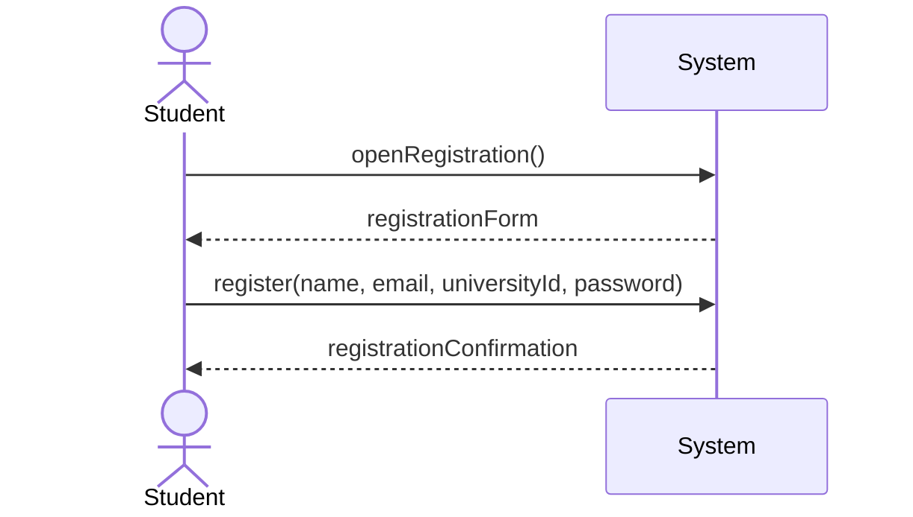

---

## UC2 — Log In

```mermaid
sequenceDiagram
    actor Actor
    participant System

    Actor->>System: login(email, password)
    alt correct credentials
        System-->>Actor: success(sessionToken, role)
    else
        System-->>Actor: fail
    end
```

---

## UC3 — View Notifications

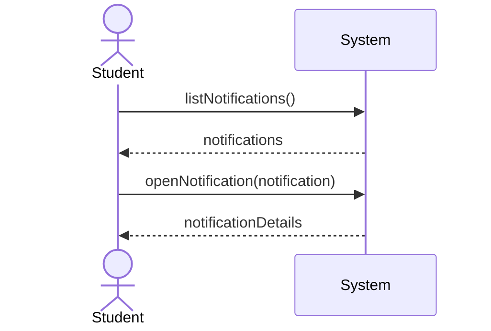

---

## UC4 — Search Catalog

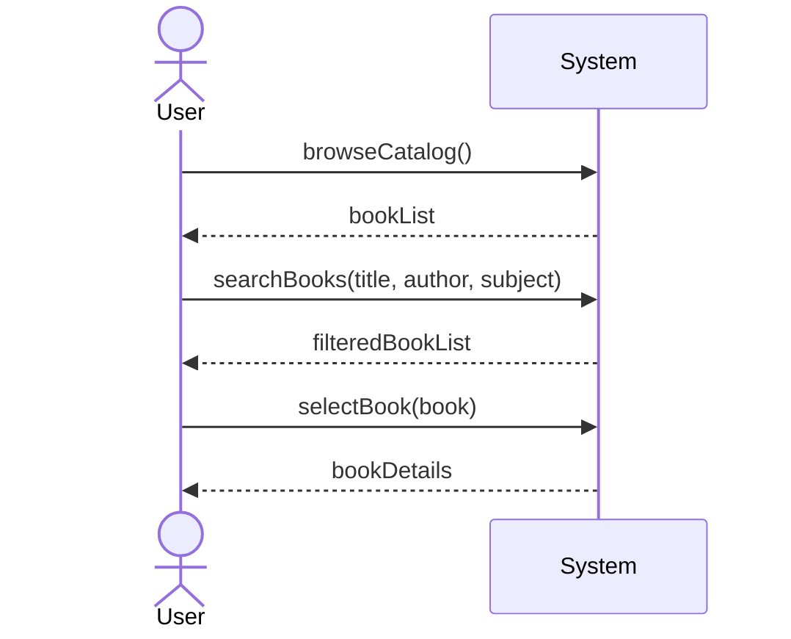

---

## UC5 — Reserve Book

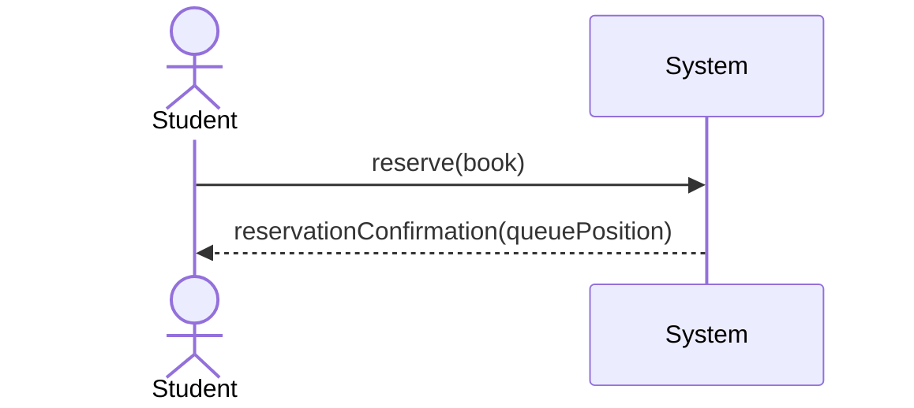

---

## UC6 — Cancel Reservation

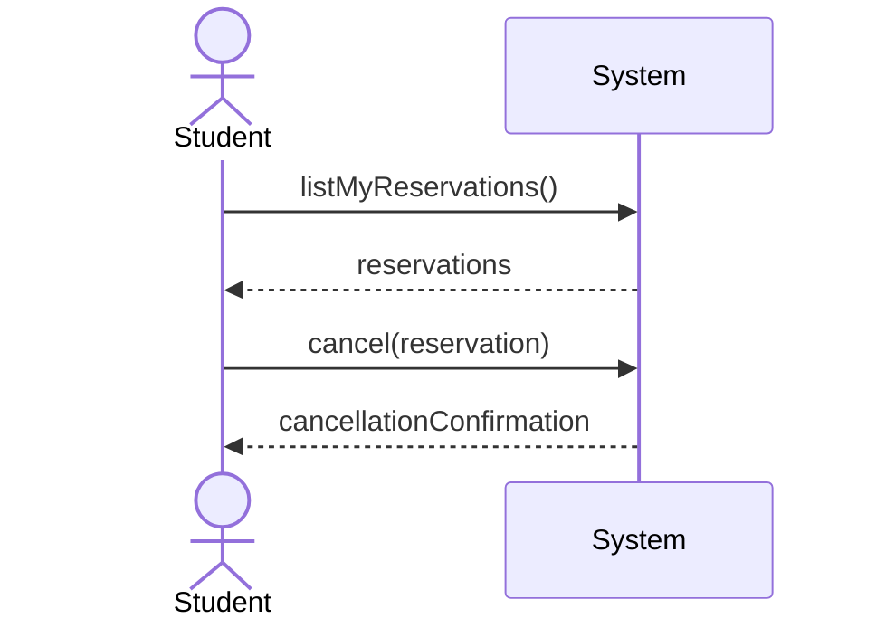

---

## UC7 — Borrow Book

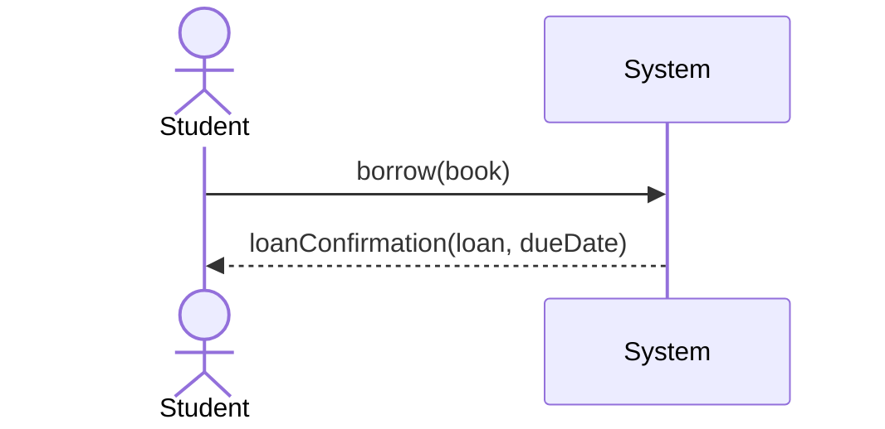

---

## UC8 — Return Book

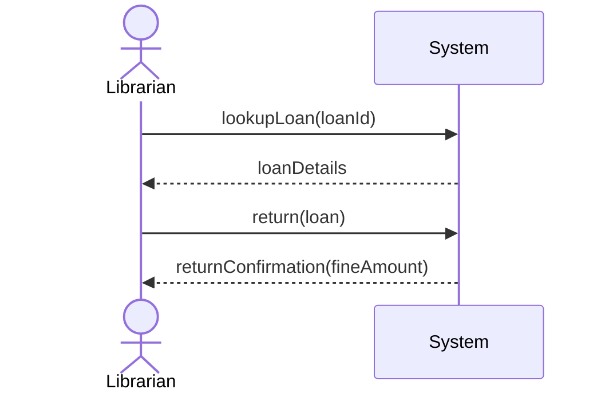

---

## UC9 — Renew Loan

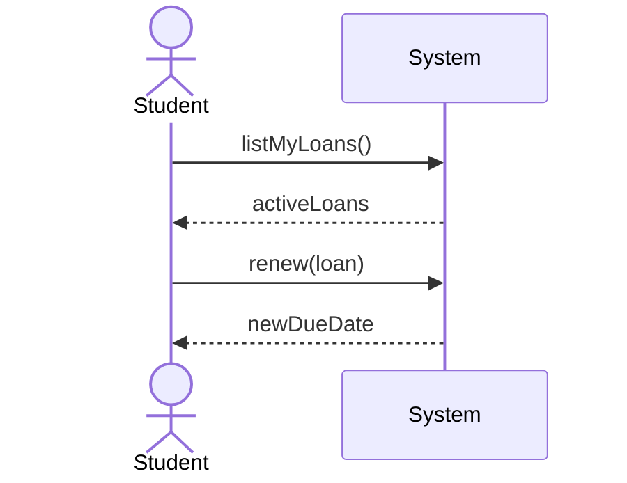

---

## UC10 — Pay Fine

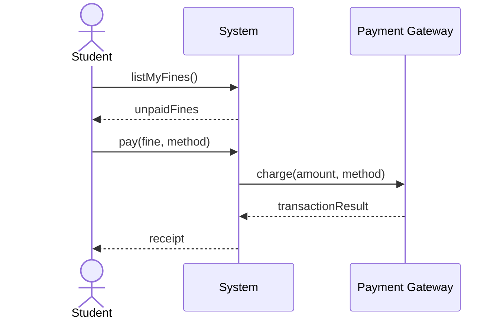

---

## UC11 — Manage Catalog

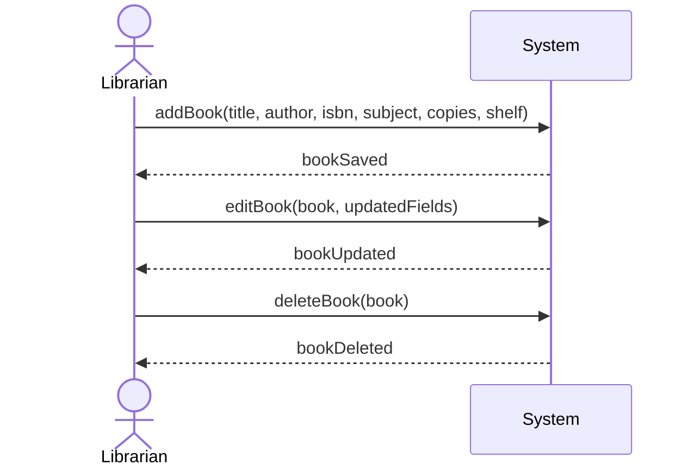

---

## UC12 — Manage Users

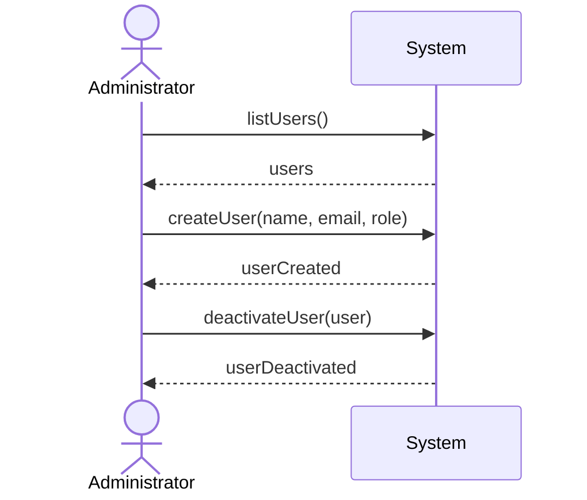

---

## UC13 — Calculate Fine

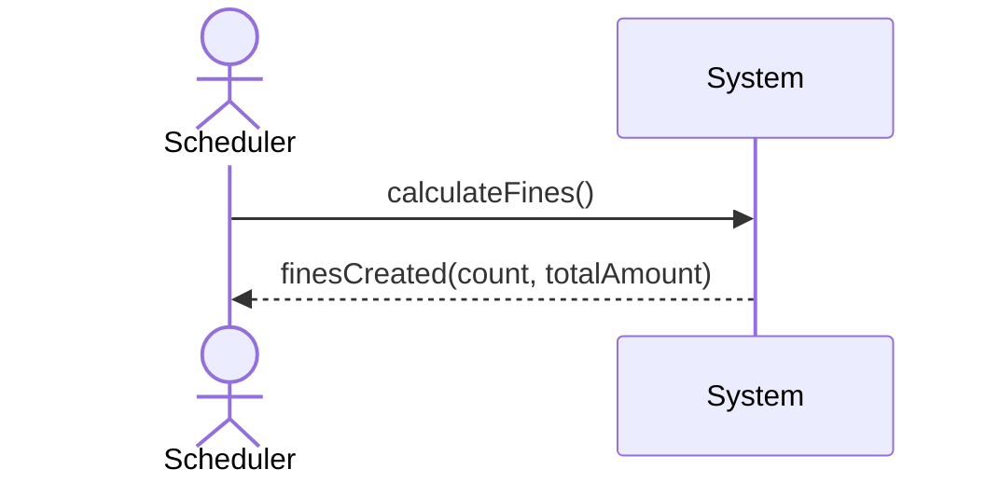

---

## UC14 — Send Notification

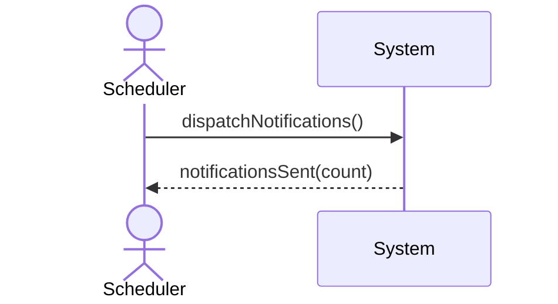
